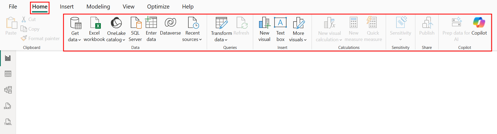
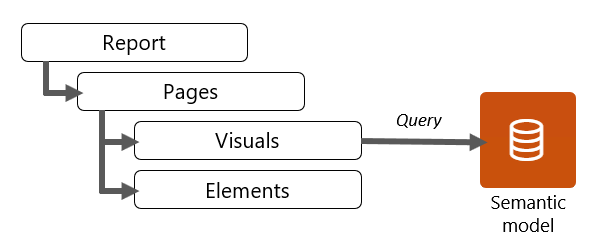
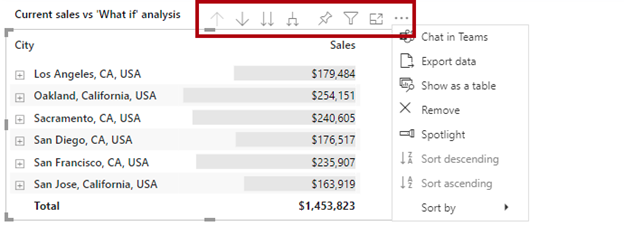
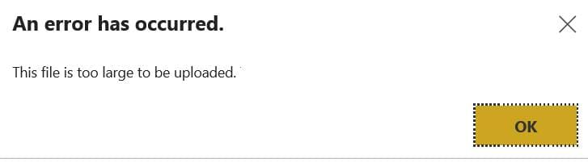
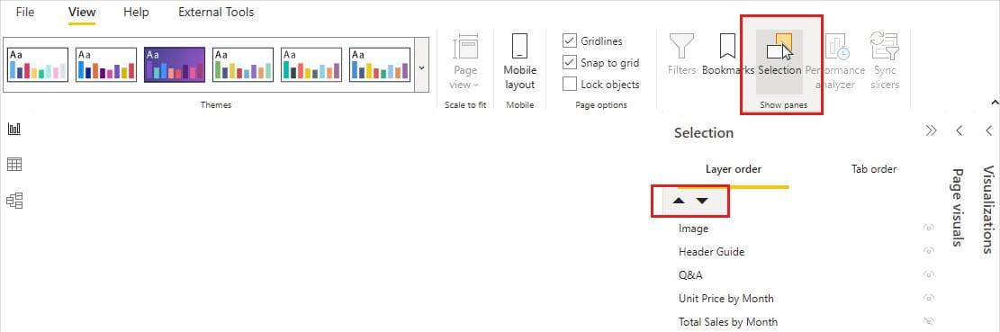

# Data Visualization with Microsoft Power BI

[Link to Return to Learn Website](https://razat94.github.io/learn/)

[Link to Download Files](https://files.educate360.com/temp/2025%20PowerBI%20Courseware.zip)
> Make sure .ZIP file is unzipped before using files.


## <p id = "toc"> Table of Contents </p>
0. [Lesson 0: What is Power BI?](#0)
1. [Lesson 1: General Structure](#1)
2. [Lesson 2: Connecting to Data](#2)
3. [Lesson 3: Cardinality](#3)
3. [Lesson 4: PowerQuery = Data Transformation](#4)
4. [Lesson 5: Visualizations](#5)
5. [Lesson 6: Creating Interactive Visualizations](#6)
6. [Lesson 7: Additional Charts & Features](#7)
7. [Lesson 8: Data Modeling w/Calculated Columns & Measures](#8)


## Welcome! 
This document outlines the two-day Power BI workshop curriculum, focusing on data transformation and visualization.

This course is designed to guide you through the essential components of Power BI, from importing raw data to building insightful and interactive dashboards. After reviewing this guide, I chose to use GitHub as the platform for presenting the material:
https://microsoftlearning.github.io/MCT-User-Guide/


### Day 1: Data Fundamentals & Transformation
Day One focuses on the foundations:
- Learn the basics of Power BI and its overall structure
- Import data from various sources
- Transform, clean, and model data using the Power Query Editor
- Understand cardinality and its impact on data modeling
- Get a brief overview of creating basic reports

### Day 2: Advanced Visualization & Calculations
Day Two centers more heavily on analyzing & visualizing data through:
- In-Depth Visualizations: Creating, configuring, and formatting a variety of visuals
- Discussion of Advanced Settings: Exploring complex visual properties and settings
- Calculated Columns & Measures: Understanding the difference between columns and measures, and creating them using DAX


### Useful Links:  
- [Main MS Learn Course PL-300T00-A](https://learn.microsoft.com/en-us/training/courses/pl-300t00)
- [Practice Exam](learn.microsoft.com/en-us/credentials/certifications/data-analyst-associate/practice/assessment?assessment-type=practice&assessmentId=48)  


/* -------------------------------------------------------
## <p id = "0"> Lesson 0: What is Power BI? | [Back to ToC](#toc)</p> 
---------------------------------------------------------- */

### /* ------------ Lesson 0 - What is Power BI?  ------------ */
Please refer to the [PowerPoint](https://docs.google.com/presentation/d/1q2-8hYULWp8ouBpQMGMV_SMCWjE6Rphl/edit?usp=sharing&ouid=113396737692127154003&rtpof=true&sd=true)

General Overview:  
	1. We create a report in Power BI Desktop  
	2. Share it to the Power BI service  
	3. Interact with reports in the service and Power BI Mobile.

/* -------------------------------------------------------
## <p id = "1"> Lesson 1: General Structure | [Back to ToC](#toc)</p> 
---------------------------------------------------------- */

#### Task: Open "Getting_Started.pbix"

We have opened up a Power BI file which are referred to as a "Report" & has a file extension '.PBIX'. Power BI files are treated as reports, even if they contain no visuals and only include a semantic model associated with the report.

"At the top of the window within the ribbon, you'll see the Home tab where the most common operations you perform are available" [MS Learn Resource](https://learn.microsoft.com/en-us/training/modules/intro-power-bi/tour).


		
On the ribbon, the 'File' tab provides access to the Backstage View, which contains application settings and configuration options.

For instance, "Preview Features" is a setting that lets users try new features before they're officially released. These features can be turned on or off by going to:
	```
	Files -> Settings -> Preview Features.
	```

For instance, the Shape Map visual can be available in the report-building tools by going to 'Preview Features' and checking off:
- Shape Map Visual

> Note: Make sure to close the file and reopen it to see the affects.
		
Additional Recommended Settings are:
- Modern Visual Tips		
	- Modern Visual Tooltips improves the pop-up information users see when hovering over charts and other visuals.
- On Object Interaction
	- When enabled, this feature replaces the traditional side-panel panes with a more compact view that groups options to save space, making it easier to switch between panes. [Source](https://learn.microsoft.com/en-us/power-bi/create-reports/power-bi-on-object-interaction)
- To enable Dark Mode: 
	1. Select File -> 'Options and Settings' -> Options 
	2. Choose 'Report Settings' from the left pane.
	2. Under 'Customize Appearance' (preview), select your preferred theme.

### Power BI Interface

The Left Navigation Bar in Power BI Desktop shows different views:  
[MS Learn Article: Power BI Desktop Overview](https://learn.microsoft.com/en-us/power-bi/transform-model/desktop-query-overview?utm_source=chatgpt.com)

- Report View  
	- The Report View is where data can be turned into visuals. The center area of the view is the "report canvas" where visuals are added.
	- Similar to MS Excel, there is a status bar where pages can get added/removed where each page portrays a different story!  
	> Note: On Power BI Service, a dashboard is just 1 page.

	

	- This Report View contains three panes on the right (Each pane can be minimized or maximized as needed):
		
			- Filter Pane: By dragging a field, we can filter: 
				- a single visual 
				- the entire page, 
				- or the whole report 

			- Visualization Pane: 

				- The first section of the Visualizations pane will display the core visuals; Power BI includes over 30 core visuals, which are built in and available to all reports. 
				
				- Notice that if a chart has been selected,
				notice that:
					-  a selected chart will  display several sections (in the same pane) specifically related to that chart (e.g. X-Axis & Y-Axis).
					- clicking a chart icon will replace the currently selected chart.
				
			- Data pane: 
				- Lets us view all the tables and columns that are imported or set up
					- Similar to the Pivot Table Fields pane in Excel.
					- NOTE: Data Pane shows fields in A-Z ORDER
				- We can create & work with different types of data.	
		
		---

		Clicking on the chart itself will display <b>Visual Headers</b> which are similar to Excel Chart Tools.  
		https://learn.microsoft.com/en-us/training/modules/power-bi-effective-user-experience/6-visual-headers

		

		#### Focus Mode
			Viewing the visual healders of a selected visual displays focus mode, which expands the single visual (like a chart, table, or map) so that it takes up the full page (the entirety of the canvas).
			
	- Table View - Shows Raw Data Records
		- Notice that each view has a slightly different ribbon but you can still import data on any view.
		- Notice that on the Table View, the familiar Data Pane on the right will still be there to show the various tables and columns.
		- Data is read-only; we edit in Power Query via Home -> Transform data to change, replace, or create new values in your dataset.

	- Model View - Properties & Relationships with Tables.	
	[Source](https://learn.microsoft.com/en-us/power-bi/transform-model/model-explorer)	
		- This view displays the 'Semantic Model', which contains:
			- Actual data from tables and columns.
			- Metadata that defines how the data is organized and interpreted including: 
				- Relationships between tables
				- Measures (calculations using DAX)
				- Hierarchies (e.g., Year → Month → Day)
				- Additional metadata (e.g., names, data types, and descriptions).

	- Dax Query (relatively newer) - Here we can run DAX & see exactly what a measure will show.

	This DAX query uses `TOPN` to retrieve the top 5 rows based on a specific column, with `ORDER BY` defining the final display.
	```
	EVALUATE
		TOPN(5, Table, Table[Column], DESC)
		ORDER BY Table[Column] ASC
	```

	Example using a sales table:
	``` DAX
	EVALUATE
    	TOPN(5, 'Sales_Excel', Sales_Excel[Sales Amount])
    	ORDER BY Sales_Excel[Sales Amount] DESC
	```

Q: What are the building blocks of Power BI?  
	A: Semantic Models & Visualizations.
		Without a semantic model, you can't create visualizations, and reports are made up of visualizations
					
/* -------------------------------------------------------
## <p id = "2"> Lesson 2: Connecting to Data | [Back to ToC](#toc)</p> 
---------------------------------------------------------- */

In Power BI, data can be pulled from a file, a database or an online portal. Before loading data into Power BI, the #1 top priority is ensuring that the data is thoroughly cleansed and formatted as a tabular dataset.

According to one article,  
"You can use hundreds of different data sources with Power BI. The data must be in a format consumable by the Power BI Service." [Source](https://learn.microsoft.com/en-us/power-bi/connect-data/service-get-data)

## 2.1. Importing a .txt file

Power BI can transform text-based data into clear visualizations and interactive dashboards.

#### Task 2.1A: Import the text file "People1.txt" located in the  "text-files" folder.

> Note: Before doing the exercise, ensure that the data has been extracted from the .zip folder.

#### Solution 2.1A:
- On the Power BI Desktop, click `Home` -> `Get Data`.
- Select `Text/CSV` as the data source & choose the .txt or .csv file to import (e.g. `R-People1.txt`).
- The file preview displays the data so that users can quickly check if their data is correct. 
	- Click `Load` to import the file, or `Transform Data` to clean and edit it first.
- Once imported, verify that data has been imported by going to `Table View` to view the table `People1`.
	- All data imported into Power BI is structured as tables consisting of rows (records) and columns (attributes), similar to a grid or a spreadsheet.

Note: Although no visuals have been created yet in Report View, the data is still stored and can be viewed in the Data View.
> Note that a .pbix file is still considered a report file, even if there aren't any visuals created yet. 

> Optional Task: Create a chart that displays the number of people living in each location.

Importing data into Power BI stores a snapshot of the data in the .pbix file. This means that even if the original .txt file is later deleted, the report and its visuals will still work since the data is already embedded.  
- Think of it like embedding a file in PowerPoint or attaching a PDF to an Outlook email. It doesn't matter if the original file is deleted since a copy is already stored within the document or email.

```
Task 2.1B: Delete the imported table (that has been loaded into the semantic model) & reimport it.  
```

#### Solution 2.1B:
- Go to Table View (Model View also works).  
- Right-click the table name in the Fields pane.  
- Click 'Delete from model'.  

```
Task 2.1C: Update the data in the source file & refresh it in Power BI:
```

#### Solution 2.1C:
1. Confirm that the data is already loaded in Power BI. 
2. On the .txt file, make the following changes:
	- Change the row 'Justine' to 'Justin'
	- Add a row "Carl"
3. Make sure to save the changes on .txt file.
4. In Power BI, data can be reloaded in two main ways:
- Refresh all tables at once:  
On any view, go to Home (Tab) -> Queries (Group) -> Refresh to update every table in the model.
- Refresh a single table:  
From the Data pane on the right, right-click the table name, and choose 'Refresh' to update only that specific table.

		Note:
		Paid version does a Scheduled refresh up to 8 times/day
		You can use Live Connection for example with SQL Server that automatically updates the data in Power BI.
		Every time you interact with a visual (filter, slice, drill down), Power BI queries the SQL Server in real time
	
> Please note that if the source data file is moved or deleted, the report and visuals will still remain intact, but the data refresh will stop working. 

To update the connection link if the file is broken/moved:
- Under data source settings, the connection path to the file must be updated to reconnect the link.

---

Optional Exercise: Entering/changing data is not ideal with Power BI. PowerQuery can be used to update the naming.

		1. In Power BI Desktop, go to Home (Tab) -> Data (Group) -> Enter Data.
		Create a small table with the new row(s) you want 
		NOTE: Make sure to update the header row correctly; otherwise, it won’t work as expected.
			Example:
			Name	Age	Location
			Raza	25	LA
			
		2. 
		We must now append our new table (the one with only 1 row) to the original table via Power Query 
			2.1. Launch PowerQuery via Home -> Transform Data
			2.2. 	[Confirm we're viewing data from People table] 
				On PowerQuery Editor, go to Home → Combine (Group on far right) -> Append Queries
				Table to Append -> Table with the row added.
			2.3. In PowerQuery, we should see now that new row added. 
			2.4. Finally to load it into PowerBI, click Home -> Close & Apply

## 2.2. Importing a folder of .txt files
	
In Power BI, the 'Folder' import option can be used to combine multiple data files into a single dataset

Real-life examples of combining multiple files:

Example 1: A student mentioned aggregating monthly contractor data into a single, yearly report.  
Example 2: Monthly sales data stored as CSV files in a SharePoint folder can be appended provided that all files share the same schema.

```
Task: 
```
Since Power Query has a built-in folder connector, use Power Query to automatically combine all files into one table.


```
	This is how the folder is structured:
		Text Files [Folder]
  		├─ People1.txt
  		├─ People2.txt
  		└─ People3.txt
```

```
Solution  
```

1. Select Home -> Get Data -> Folder.
2. Locate the folder path containing the files to import (e.g. the 'Text-Files' folder)  
Example path:  
C:\Users\student\Desktop\notes\powerBI\2025 PowerBI Courseware\1- Connecting to Data\Custom-Connections\text-files
3. In the pop-up, avoid selecting "Load" as this imports only the metadata.
4. Select Combine -> Combine & Load.
5. In the Combine Files window, review the table structure and settings, then select OK to import the data as a table.

Result
Just like in the previous section, viewing the table in the Data Pane verifies that the data has been import.

The table should an appended singular table that contains all of the data. This additionally creates an automated append process; <b> any new files added will automatically append during the refresh!! </b>

Sample Example: If a `People4.txt` has been added, then selecting 'Home' -> 'Refresh' will load its records into the table.
		

### 2.2 Bonus: Import only 2 .txt files in a folder
[Source](https://www.youtube.com/watch?v=vewFUbW7jaQ&t=202s)

`Task:` Import data from only `People2.txt` and `People3.txt` into the appended table.
```
Solution  
```
1. Repeat Steps 1 & 2: 
	- Import a folder by selecting 'Folder' as the data source under:  
	Home (Tab) -> Get Data (Group) -> 'Folder'  
		- Make sure to find the file path to the 'Text-Files' folder.
2. After the files have been loaded on the pop-up, click 'Transform Data' to open the Power Query Editor.
3. In Power Query, start by filtering the `Name` column to keep only the files you want to append.
4. Afterwards, remove unnecessary columns by right-clicking the 'Content' column & selecting 'Remove Other Columns'
5. Finally, use the 'Combine Files' button (i.e. the icon with two arrows) to merge all files into one dataset.

## 2.3: Importing Excel Files

This subsection will cover how to import data in MS Excel into Power BI.

```
Task: On the same report, import a spreadsheet from the file 'Pivot your table like a champ.xlsx'
```

When importing spreadsheets that have data, notice that sources with table icons will have a blue header, while 
sheets are tabs that use the 'Navigator' settings.

Once the data has been imported, we can create visuals. Visuals are visualizations of the semantic model data (e.g. charts, graphs). 

Task: On the report, create a page & name it "Performance Highlights"

		Make a very simple chart of sales person vs amount of sales.
		From the Visualizations pane, select the visual type "Clustered Column" and then position and size it to 1/2 the canvas page.
		
		- Create 2 cards: One showing the name of Salesperson & the other showing Total Amount.
		- Remember:  A card visualization displays a single data point.

		> NOTE: If you don't see the card element, open the Visualizations pane, click the three dots (...) in the "Get more visuals" section, and choose "Restore default visuals" to bring back the default card (and other items).

		Note: After selecting a visual, changing the chart type will modify the existing chart rather than creating a new one.
		
Task: Exporting How-Tos
	
	- Export report as PDF
	- Charts
		- A Chart can be copied and pasted within Power BI by right clicking on chart -> Copy chart 
		- Take a screenshot of a chart either with snipping tool or Win + Shift + S
		
		- To Export data from a chart
		(Click on chart  -> Ellipses (on the Visual Header e.g. charts tools button) -> Export Data)
			
	
Optional Task: Importing the table from "Data-Pub1.xlsx" 

	-- Review Q: --
	Q: When importing data from an Excel workbook into Power BI, if you receive the error message: 
	“We couldn't find any data formatted as a table.”
	What should you do to resolve the error?

	A: In the Excel workbook, select the data you will import, create a table, and save the change.
	-- 


## 2.4: Importing an Excel File located on a OneDrive/SharePoint
[Source](https://learn.microsoft.com/en-us/power-bi/connect-data/desktop-use-onedrive-business-links)

```
The following solution is taken from the above link:
```

1. 	Using a browser, navigate to your OneDrive for work or school location 
	Select the ellipses (...) to open the More menu, then select Details.

2. 	In the More details pane that appears, select the copy icon next to Path.

> Note that if the OneDrive file is open on the desktop Excel app, the file path can be copied (for importing) by going to File -> Info -> Copy path. Ensure that the extension ends with `.xlsx`


3. 	In Power BI Desktop, select Get data > Web

4. 	With the Basic option selected, paste the link into the From Web dialog.

5. 	If Power BI Desktop prompts you for credentials, 
	choose either `Windows for on-premises SharePoint sites` or `Organizational Account for Microsoft 365` or `OneDrive for work or school sites`.

6. 	RESULT:
	A Navigator dialog appears. 
	It allows you to select from the list of tables, sheets, and ranges found in the Excel workbook.
	From there, you can use the OneDrive for work or school file just like any other Excel file.


## 2.5 Optional Subsection: Importing SharePoint list data into OneDrive --
[Youtube Tutorial](https://www.youtube.com/watch?v=eyUwG2tlWn4)

Step 1: On Power BI Desktop, click on Get Data in the top-left corner. Since SharePoint might not appear in the initial list, click on More.

- From the Get Data window, search for "SharePoint".
You’ll see a few options: 
	- SharePoint Folder, 
	- SharePoint Online List, 
	- and SharePoint List.

	<br/>

	- The SharePoint Online List connector only works with SharePoint Online (preferred choice if you use SP Online).
	- The SharePoint List connector works with both SharePoint On-Premises and SharePoint Online. 
	

Step 2: Enter the SharePoint Site URL and copy the root site URL (not a link to the SharePoint start page, or a specific file/folder).


	Example: 	
		- https://yourdomain/sites/yourSharePointName
		- https://viltclasses.sharepoint.com/sites/MS-Power-BI

Paste the URL into Power BI and click OK.

Step 3: Connect your Microsoft account to Sign In to SharePoint
	
	- Avoid using "Anonymous" or "Windows" authentication since those typically won't work unless you're on a corporate domain setup.
	- Choose 'Microsoft Account', and sign in with the account that has access to your SharePoint site.

Step 4: 
	Once connected, you'll see a list of all available SharePoint lists. 
	Select the list you want but note: you might notice some extra columns that are metadata fields automatically added by SharePoint.
	You can reshape it before loading if you'd like via PowerQuery otherwise press "Load" and deleting the extra columns.
	
Result: Once loaded, you'll see your SharePoint data available in Power BI.

	--
	If the following error shows up: 
		'MSOffice.PowerBi.OleDb' is not registered
		https://www.reddit.com/r/PowerBI/comments/wkzmj8/error_connecting_to_sharepoint_online_list_the/
	We recommend to uninstall & install Power BI again.
	--

## 2.6 Optional Subsection: Importing a table from SQL Server to Power BI --
Feel free to read the guide 
[here](https://github.com/Razat94/learn/blob/master/PowerBI/Guide%20-%20Conenct%20SQL%20Server%20to%20MS%20Power%20BI_compressed.pdf).

/* -------------------------------------------------------
## <p id = "3"> Lesson 3: Cardinality | [Back to ToC](#toc)</p> 
---------------------------------------------------------- */

Useful Links:  
	[Module: Configure Semantic Model](https://learn.microsoft.com/en-us/training/modules/configure-semantic-model-power-bi/)  
	[Chapter: Configure relationships](https://learn.microsoft.com/en-us/training/modules/configure-semantic-model-power-bi/2-relationships)		


-- Subsection: Forming 1x1 cardinality --  

```
Task: Open "Employees.pbix" or Import data from "Employees.xlsx" 
```

Recap:
Data imported into Power BI is organized as tables.
A table is a grid similar to a spreadsheet, where data attributes as columns and records as rows.
	
Data is often divided across multiple sources or tables.
For instance, we can import:
- a Sales Orders table which contains data about orders placed, 
- a Products table that lists out each product’s details, like name, price, and category.
- a Customers table that lists out their name.

Relationships show how data in one table connects to data in another.
	
	Once a relationship is formed (usually it's done automatically), we can reference data from separate tables & create visuals from them.
		For example, VLOOKUP can use/reference the Product table to find details for products in the Orders table.

In this example, this relationship we have is a 1:1 relationship with the key being on EID.
	Each employee has a respective salary.
	We can create a chart that shows average salary per region. 

	
	Q: 	The tables are basically =vlookup "keys" when thinking in terms of excel correct?
	
	A.	In Excel, a VLOOKUP uses a key to pull matching data from another table.
		In Power BI or relational databases:
			Dimension tables have the key you “look up” (like the first column in a VLOOKUP table).
			Fact tables have the foreign key that points to the dimension table (like the value you pass into VLOOKUP).

Relationships in Power BI are basically automatic VLOOKUPs behind the scenes, connecting the keys so you can pull related attributes or measures.

3 purposes why we should normalize data:

		- Usually data is spread out into various tables; Data is seldom combined into one big table anyway.
		- Normalizing our data avoids redundancy 
		- We can "Hide table from report view" by right clicking on table.
			- The principle of least privilege (PoLP) is a security practice,
				where only the minimum level of access necessary to perform tasks are granted & nothing more.
				i.e. Not every user needs to know about everything. 

	
	
-- Subsection: Forming 1xMany Cardinality --  
```
Task: Open 'Example-Star-Schema.pbix'
```

Let's look at the following data:
		
	1. Fact-SalesOrders (Fact Table)
	SaleID	CustomerID	ProductID	Quantity	SalesAmount
	1	1001		101		2		40
	2	1001		103		2		20
	3	1002		102		1		15
	4	1002		102		2		30
	5	1002		103		1		10


	2. Dim-Customer (Customer Dimension)
	CustomerID	CustomerName	Region
	1001		Alice		North
	1002		Bob		South


	3. Dim-Product (Product Dimension)
	ProductID	ProductName	Category
	101		T-shirt		Apparel
	102		Mug		Accessories
	103		Notebook	Stationery


	When your data model has multiple tables, make sure the tables are properly related so that we can use them in visualizations.


== STAR SCHEMA ==  

Useful Links:
- [Star Schema Link #1](https://learn.microsoft.com/en-us/training/modules/choose-power-bi-model-framework/2-describe-power-bi-model-fundamentals#star-schema-design)
- [Star Schema Link #2](https://learn.microsoft.com/en-us/power-bi/guidance/star-schema)
	
		A Star Schema is a schema design/data modeling approach. 
		It is a way to organize your data in Power BI (or any data warehouse). 
		Encourages Data Normalization, which "is used to describe data that's stored in a way that reduces repetitious data."	
	
		Ultimately, its used to organize your data since it's a design for that structure.

Star Schema consists of:
			
			One Central Fact table — contains measurable RAW transactional data (e.g., sales, revenue, quantities).
				The CENTER event that contains quantitative data.
				In Star Schema, we should only have one FACT table of ONE object
					Note: This is not a hard rule; we can have multiple tables e.g. Fact Tables of in-person vs online Sales.
				The fact table dimension key column stores duplicate values, so it is 'many' side of 1-Many.
			Multiple Dimension tables — The Points of the Star; describe the "who, what, when, where" of the facts.
				MAY SEEM RELEVANT OR NOT.
				Can be thought of as lookup tables.
				For instance, knowing someones salary may not be important. 
	
		Remember: The overall layout looks like a star 🌟 — 
			The Fact table is in the center and Dimensions are around it.		
	

		Fact table relate to dimension table via keys, just like key relationships in a database.
			A fact table dimension key column is expected to store duplicate values, so must be the 'many' side	
			Dimension tables have a unique key column that forms the 'one' side. 

		
		In database lingo:
			DimCustomer[CustomerID] is a Primary Key - No two identical rows!
			All values in CustomerID are unique → Valid primary key.

 	

(Optional More practice) -  
	Optional Excercise #1:  
	Import "MyFootprintSports.xlsx" to form 1xmany cardiniality.
			- Discuss how Products & Employee tables connect to the Sales Orders


	Optional Excercise #2:
	Delete prev table & now import "Bonus Example 1 Sales Data"


-- Final Subsection: Forming relationships across different sources --  

	Task: Import Leaps&Bounds spreadsheet & database.

	1. Form Relationships in Model View
	When importing data from different sources (in this case, a spreadsheet and a database), 
	use Model View to create relationships. In this example, we will relate:

		[AgentInfo].Agent# 		-> [Bookings].Agent#
		[Destinations1].Destination# 	-> [Bookings].Destination#

	2. Once relations are created, we can create visuals:
		- Build a chart showing total sales by agent.
		- Add two card visualizations: one for NAME and one for AMOUNT.

		Remember: A card visualization shows a single data point. 
		By default, the card displays the first value alphabetically (e.g., Carol Cox will appear first),
		but you can change it to “Count (Distinct)” to see the total number of unique agents.
	
		Student Comment:	I love Cards! Favorite viz tool in PBI!

		
	- (Optional Q's) -

	-- Q1: --
	Q: You have designed a star schema to simplify your data.
	You need to understand the relationship between the tables in the star schema.

	What is the relationship from a fact table to a dimension table?
	A: A fact table has a many-to-one relationship with a dimension table.


	-- Q2 --
	Your company uses Power BI to analyze sales data. 
	The data model includes a fact table called 'Sales' and a dimension table called 'Regions' with unique region names.
	You need to filter sales data by region. What should you do?
	
	[x] A. Creating a one-to-many relationship from 'RegionName' in 'Regions' to 'Region' in 'Sales' enables effective filtering of sales data by region. 
	B. Combining the 'Sales' and 'Regions' tables into a calculated table is inefficient and unnecessary for filtering by region. 
	C. Enabling bidirectional cross-filtering for relationships is unnecessary and could lead to ambiguity. 
	D. Setting the cross-filter direction of the existing relationship to single does not establish a relationship if one does not already exist.


	-- Q3: --
	Your organization has a Power BI model with multiple tables, 
		including a  'Sales' table with transactional data and a 'Products' table with product details.

	You need to aggregate sales data by product categories.
	What should you do?

	A. Creating a many-to-one relationship from 'Sales' to 'Products' 
	ensures accurate aggregation by aligning transactional data with product details.
	

	-- Q4: --
	Q. You are designing a data model in Power BI.
	You need to avoid introducing ambiguity into your data model design.

	Which type of cardinality should you avoid?
	A: Many to Many
	-- --


/* -------------------------------------------------------
## <p id = "4"> Lesson 4: PowerQuery | [Back to ToC](#toc)</p> 
---------------------------------------------------------- */

Chapter 3 -  
Power Query Editor provides the ability to transform and analyze data.  
Remember: Power Query = Data Transformation

/* -------------------------------------------------------
## <p id = "Day2"> DAY 2 | [Back to ToC](#toc) </p>
---------------------------------------------------------- */	

Links:  
	- [Add visuals](https://learn.microsoft.com/en-us/power-bi/visuals/power-bi-report-add-visualizations-i?tabs=powerbi-desktop)  
	- [Design Power BI reports](https://learn.microsoft.com/en-us/training/modules/power-bi-effective-reports/1-introduction)  
	- [Design effective reports in Power BI](https://learn.microsoft.com/en-us/training/paths/power-bi-effective/)

/* -------------------------------------------------------
## <p id = "5"> Lesson 5: Visuals & Analyzing such Visuals | [Back to ToC](#toc)</p> 
---------------------------------------------------------- */

Once the data is imported, we can now build visuals in Power BI Desktop to explore trends, patterns, and connections.

> Note: Users familiar with PivotTables and PivotCharts in Microsoft Excel will notice similarities with Power BI visuals!
		
Task: Create a blank report.  
Import "Sales Data". Once the data has been imported, verify that the Fields in Data Pane (on far right side) appear & are sorted A-Z.

## 5.1. Using Our First Page

Power BI helps turn data into clear, interactive charts and visuals.

```
Task: Name the page "Sales per Rep" and perform the following subtasks:
```

Subtask 1:  
In Quadrant 1 (1/4 page), create a simple column chart that displays the total sales by salesperson.

	Tasks:	
		- Apply settings for changing X AXIS

		- In the Visualizations Pane, change the 'Total sales' field from SUM to AVERAGE. 	
		- Change the chart's sort order by clicking the three dots (More Options) in the Visual Header Icons -> Select Sort Axis, and choose Ascending (Lowest to Highest) instead of Descending.
			[Learn more about sorting](https://learn.microsoft.com/en-us/power-bi/consumer/end-user-change-sort)
			- Optional Task: Sort axis by 'Salesperson', not by 'Sum of Total Sales'

		- Change interval of y-axis: 
				Select the Visual -> "Format Your Visual" pane -> Visual -> Y-Axis -> "Maximum" to 5000 (or similar).
					Q: Can we set the interval in sets of 25000?
			 		A: No. No direct setting to force specific intervals (like strictly every 1000 units) 
			- Update Gridlines:
				Make the gridline more noticeable via Format Visuals -> Gridlines 
					-> Change Color to black
					-> Change Width 
			- Add Legend:
				Drag the 'Salesperson' field to Legend Area (observe color change).	
				Then under Visual Pane -> Visuals -> Legend ->
					Customize: Text: Bigger, Position: Center Right 
				If we click on the legend, it forms a highlight
			- Update Gridline : 
				- Changed color to black
				- Changed the width

Two things to note:

	> Note: The Fit to Page icon (bottom-right corner of PowerBI next to Zoom bar) resets zoom to standard fit if zoomed in/out.

	--- 

	> Recall: Focus Mode lets you expand a single visual (like a chart, table, or map) so it takes up the full page (the entirety of the canvas).

Quadrant 2 (1/4 page):

	Note: When we start adding Visuals, visuals can be COPIED + PASTED	
	- Create 2 cards: One showing the name of Salesperson & the other showing Total Amount.
		Remember:  A card visualization displays a single data point.

		Task: 
			Add Title. One for "Sales" & other for "Salesperson".
				Optional: Turn on "Divider" 	
			Change/modify chart title:		Click on chart -> Visualizations Pane -> General -> Title				
			Change font size:			Visual Pane -> Visual -> Call Out Value -> Font = 45
			ROUND Decimal Places:			Visual Pane -> Visual -> Call Out Value -> 'Value Decimal Places' = 2
			Set up a border: 			Visual Pane -> General -> Effects -> Visual Border (10px black)
			Change text color: 			Visual Pane -> Visual -> Call Out Value -> Color (Dark Yellow)
			Change background color of a card: 	Visual Pane -> General -> Effects -> Background (Light Gray)
				Color Options: Black background with White text color.
				Note: Backgrounds change when the theme is changed too.
	
Quadrant 3 (1/4 page)
	
	- Add the Skillable Office image to your report (Insert tab -> Image)

	Note that large pictures will fail to display in Power BI



## 5.2. The Selection Pane
The Selection Pane (under the View tab) works similar to PowerPoint (even has the same icon!) which allows the user to reorder layers and toggle (show/hide) elements. [Source](https://learn.microsoft.com/en-us/power-bi/create-reports/power-bi-create-mobile-optimized-report-order-layers)

The Selection Pane can be accessed by going to View(Tab) -> Selection Pane.



#### Grouping
Similar to PowerPoint, Power BI Desktop can combine visuals, buttons, and text all into a single group. This lets users select multiple elements all at once rather than selecting each item individually.

[Source](https://learn.microsoft.com/en-us/power-bi/create-reports/desktop-grouping-visuals)

Task: 	Group all cards together.  
Task: 	Group elements on the right and label it 'RHS'.

Q: How to align shapes, like in PowerPoint?  
A: Select All > Format Tab > Align
 
## 5.3. Adding Elements
Pictures are apart of elements. 

Task: Create a new page titled 'Elements' to discuss more about elements.


	Recall:
	Visuals - Visualizations of semantic model data.
	Elements - Provide visual interest but don't use semantic model data. 
		Elements include text boxes, buttons, shapes, and images.

Task: On the new page, let's cover the different ways to add text to a canvas page:  
	1. (Not recommended) Create a textbox:
		- (Similar to PowerPoint)	Insert -> Textbox  
	2. (Preferred) Insert Shape: 	Insert -> Shapes -> Rectangle
		(Result: A blue box has been added)
		A simple background can always be added to a card/shape. 
			Add text by accessing the settings in the pane.  
	3. Create a card & then:  
		1. Add a measure that says: 	msg = "Hello World!"
		2. Add the measure under the "Fields" section of a card.

			Subtask:
			Add a salesmessage:

			SalesMsg = "The total sales is: " &
			SUM(Data[Total Sales])

		Subtask: Add text/background styles to a card:
		Format Shape Pane -> Shape -> Style:
			- Text: (Under same style category) Make sure to turn "ON" 
				Add your text, change font size to 30

			- Fill: Change Color
				(If fill has been disabled here, 
				then alternatively General -> Effects -> Background 
			 	would work like what we've seen before w/ shapes)


-- Subsection: Buttons --

	Task: On a new page, add the following buttons under Insert -> Buttons:
		- Back Button (Once placed on canvas, Press Ctrl + Click to activate)
		- Page navigation! (Just like in PowerPoint)
			First create a page named "Home" or "Main Hub".
			Create button (e.g. a Circle shape) 
			Under the Shape tab in the Visual Pane, set Action -> Type -> Navigation, and link it to the previously created pages
			'Products/Region' and 'Products/Quarter'."
		- Bookmark Button
			- Under Button (Visual Pane Tab) -> Action -> 
				Type = "Bookmark" & BookMark = "Page 1" 
		- Insert a PANDA pic & add a link to the LA ZOO via "lazoo.org"
			Q: Does the 'panda' link work when you export to PDF?
			A: NO!!
		- Information Button
			- Add a Tool Tip [Under Visual Pane -> Button -> Actions -> Tooltip]
				Add text: "Please make sure to see the pages for the ENTIRE report"
			- Set it so nothing happens if the user accidently clicks it by mistake:
				Button (Visual Pane Tab) -> Actions -> Type = "Bookmark" & BookMark = "None" 
			- Give your tooltip a background color so people see easily via 
				Visual Pane -> Button -> Button -> Style -> Fill <OR> Style -> Glow 
				OR 
				General -> Effects -> Background
		- Optional: Create a button that's clears all slicers
			Remember: To activate the effect, we must Ctrl + Click the button.
		- Optional: A button on the report page could have the text 'Reset slicers', and when invoked, it uses the bookmark.
		Additional Info on Bookmark Buttons Settings:
			https://www.youtube.com/watch?v=rgKtgQhPPrg
			Data -> Reset data
			Display -> Spotlight, Showing/Highlighting
			Current Page -> Deselecting means we don't jump to that page, but that those settings are applied.
		- Q&A
		If a page contains data, 
		we can have Q&A access that data by going to said page and without selecting anything, click
		the Visual Pane -> "Format Your Page" -> Page Information -> Allow Q & A

		Sample Q's to ask:
			- count products
			- what are all the salespeople?
			- what are all the regions?
			- what are total sales / Get overall sales

		After we have our Q&A result, 	
		click on the "Turn this Q&A result into a standard visual" at the top right of visual to turn it into a standard visual 

		Q:	You added the Q&A feature to let users find answers on their own. 
			Which two configurations can you add to improve the search capabilities for them[end users]?"
		A:	- Add a linguistic relationship schema to the dataset.
				A linguistic schema describes terms and phrases that Q&A should understand for objects within a dataset, 
				including parts of speech, synonyms, and phrasings that relate to that dataset.
			- Add synonyms to model fields will help users search for them. 
				For example, you can give a synonym of (Actuals) for the (Sales) measure. 


## 5.4. Background Formatting
--- Subsection: Background Formatting ---

Create a new page called "Formats". 
Click the background of your page, then go to Visualizations -> "Format your report page" on the sidebar

TASK: CHANGE THE PAGE TO 1000 by 500 px  
	
	Q: "Can you make the canvas taller so you can scroll to more visuals rather than change pages"  
	A: Yes, under 'Canvas Settings' -> 'Type' = Custom & Height = "1000px"

Task: Change background color of Canvas 
	
	'Canvas Background' applies color only to the main page canvas
	Note: We MUST change the transparency color to not be 100%.
	
Task: Change color of Wallpaper
	
	Wallpaper -> Color
	Observe: Wallpaper effects foreground & background, whereas page background effects only background

### Themes
Themes are similar to themes in MS Excel & MS Word, which applies across the entire report.

Task: Choose a report theme

	View -> Themes & then pick your fav theme! (E.g. Choose Accessible Orchid)
			
Task: Change the default Settings (e.g. set a default wallpaper color for all pages)
	
	View -> Themes-> Customize Theme -> Page -> Wallpaper -> Color 
	(Feel free to change Page Background as well)
							
Optional: Create a background in PowerPoint & then upload the theme into PowerBI.

Overview 2 Min Task: Take a moment to design your own filters, background, etc. in POWERBI. Be ready to then export

#### EXPORT A THEME 
	Once exported, try importing your theme into PowerBI. 	


## 5.5. Additional Chart Formats
--- Subsection: Bar Chart Formatting ---

Create a new page called 'Product/Quarterly Sales'
	
Quadrant 1 (1/2 page):  

	Create a 'BAR' chart mapping Product vs Sales (check off 2 fields: Product & Total Sales)
	Recommend: Turn Focus Mode On.

	NOTICE: 
			When we select a visual & open the Format Visual pane, 
			the pane shows formatting sections/options SPECIFIC to that visual
			e.g. 	For a bar chart, you won’t see a 'Columns' section because it doesn’t use columns; 
				instead, you’ll see a 'Bars' section to format the bars.

		Click on the chart & go to Format Visuals -> Bars (Remember: We have a bar chart, not column chart!)

			- Change bar colors on the chart: 
				Bars (Section) -> Color
				TASK: Make the bars to be RED instead of TRADITIONAL BLUE.

			- Change the color of a particular point (e.g. Make Laptops category a vibrant color since it sold the most):
				Bars (Section) -> Select 'Categories' (from drop down) & then select the right category.
				[One of main links]
				(https://learn.microsoft.com/en-us/power-bi/visuals/service-tips-and-tricks-for-color-formatting?tabs=powerbi-desktop)
		
			Task: Making any bar below 1M red via Conditional formatting (on Products)  
				Bars (Section) -> Select 'Categories' back to "All"
				Under color, select "FX" 
				REMEMBER: For the option "What field should we base it on?", set to "SUM OF TOTAL SALES"
				[Learn more about conditional formatting](https://learn.microsoft.com/en-us/power-bi/create-reports/desktop-conditional-table-formatting)
				

Quadrant 2 (1/4 page): 

	Create a 'WATERFALL'/FUNNEL chart mapping Regional Sales (Map Regional & Total Sales) 
		A waterfall visualization displays a running total as values are added or subtracted.
			(Note: the chart doesn't look good when mapping regions)
		A Funnel Chart
			A funnel visualization displays a linear process with sequentially connected stages, 
			with one stage transitioning to the next.

		Perhaps this will be swapped for FUNNEL 


		Click on visual & then:
			- Sort X-Axis by "Quarter" (Q1->Q4).
				
			- Create data labels under Visualizations -> Visuals -> Data Labels 
					Chose where data label is positioned: 	-> Options -> Position > Inside End
					Choose the font size			-> Values  -> Font = 20
			
			IMPORTANT TASK: Change your column chart into a Waterfall Chart!
			- Apply a color gradient to the charts columns	
				
				Under Visualizations -> Visuals -> Bars -> Under color, select "FX"
				On the pop up:
					Format Style -> Gradient
					Choose whatever color you'd like then press OK


				Note:
				Formatting applies to the value of data points (bars/lines) themselves, not the X-axis labels or categories directly.

				What if we wanted to apply a gradient across categories?
				i.e.  Have Q1 be light blue, Q4 be dark blue?		

				Work-Around: Category-based gradient formatting 
					1. Create a dummy measure that assigns a number per category

					CategoryRank = SWITCH(
						SELECTEDVALUE('SalesData'[Quarter]),
						"Quarter 1", 1,
						"Quarter 2", 2,
						"Quarter 3", 3,
						"Quarter 4", 4
					)

					Note: This assigns a numeric value to each category.
				
					2. Select our chart & go to Bars -> Color -> "FX"
						Format Style = Gradient
						What field to rank this on? = Category Rank

			
				[Learn More via this video](https://www.youtube.com/watch?v=Eop1HsBjWwo)
				

Quadrant 3 (1/4 page):

	Add a 'LINE CHART' below the previous column chart to display quarterly earnings.
		Instead of sorting x-axis of the line chart by highest to lowest, 
		- Sort X-Axis by "Quarter" so it goes (Q1->Q4)
					
		Create a a line graph that maps Monthly total sales.

		Do a filter for Q2
			let's analyze the top point by right clicking on the point -> Analyze !!!


/* -------------------------------------------------------
## <p id = "6"> Lesson 6: Creating Interactive Visualizations | [Back to ToC](#toc)</p>
---------------------------------------------------------- */

This chapter will touch base on:  
	- Customizing reports via Interactions/Filtering/Slicers  
	- Add Navigation, Controls & Buttons  
	- Groups/Drill Downs  

Helpful Links:  
	- [Visual Interactions](https://learn.microsoft.com/en-us/power-bi/create-reports/service-reports-visual-interactions?tabs=powerbi-desktop)  
	- [Turn OFF all the Visual INTERACTIONS](https://www.youtube.com/watch?v=9eEk2ct2QCI)  


## 6.1.: Highlights/Interactions 
> Note: We will continue to work off the Same Page  

Visuals in a report update dynamically based on user selections.  Power BI provides various ways to interact with visuals:

- Tooltips allow users to hover over a data point to view extra details about that data point.

- Highlighting provides visual emphasis within the SAME visual 
	- For example, on a page with a single column chart,  clicking one bar highlights (colored fully) that bar while dimming the other bars.
	- For example, when a user clicks a bar in a column chart, that bar remains fully colored while the other bars are dimmed.
	
- Cross-highlighting provides visual emphasis across DIFFERENT visuals.

	- Clicking/Selecting data in one visual highlights related data segments in another visual. Notice that this data is a subset and doesn't filter the visual completely. E.g. Selecting a bar on a bar chart can affect a different pie chart.	

	Task:  
	"Select a data point or a bar or a shape and watch the impact on the other visualizations." 
	[Source](https://learn.microsoft.com/en-us/power-bi/create-reports/service-reports-visual-interactions?tabs=powerbi-desktop#change-the-interaction-behavior)

		NOTICE:
		Cross-highlighting a chart changes the tooltip & now displays an added "Highlighted:" field which displays extra info 	

		When selecting an Interaction forms a new table, one student said: 
			Figured out my issue - click on the graph, then "Data/Drill" tab, then unclick "Data Point Table" - all good!

> Note: Turn off interactions by going to: 
``` File>Options>Query Reduction ```
& select "Disabling cross highlighting/filtering by default".
[More Info](https://www.reddit.com/r/PowerBI/comments/tfjig4/default_to_no_interactions_with_other/)
		
Task:
For the Previous Page that was recently created, apply interactions on the bar chart representing product sales to edit how this visuals interacts other visuals by:

	1. First select a visual to make it active (for e.g. Quarterly Sales Column Chart)
	
	2. On the ribbon in Power BI Desktop, select Format > Edit interactions.
	
	Now pick how other visuals react by selecting one of these three interaction behaviours:
		- Filter aka Cross Filter -> Only the filtered data remain
		- Highlight aka Cross Highlight - Default
		- None

	3. Applying a filter interaction on the FUNNEL/WATERFAL CHART
	4. Apply NO INTERACTIONS on the BOTTOM QUARTERLY SALES CHART

## 6.2. Filtering Excercise  

Helpful Resources:
- [MS Learn Article: Adding Filters to Reports](https://learn.microsoft.com/en-us/power-bi/create-reports/power-bi-report-add-filter?tabs=powerbi-desktop)

Filters can be used to narrow the scope of data and only show what the user is interested in.

The Filters pane on the right side of the report canvas can  set filters at three different levels for the report:  
	- The visual level.  
	- The page level.  
	- The report level.

Below are a few essential tasks to complete:

	Task: Create a filter on page for SALESPERSON EMMA  
	Task: Make a DUPLICATE page & then apply a filter on that page for salesperson LISA  

	Task: Filter Excercise: Show all salepeople starting M

Below are additional filters:

	- Filter Product Sales chart to show only products that generated over $1000000

	- FILTER TOP N
		Top 3 items By Value: (Field goes Here) Sum of Total Sales

	- Filters can often used to exclude blank or empty values so that averages and other calculations are based only on records containing data.
		Task: Use the table visual to filter out blanks.


Few things to note:

	Note: 	
		On the Filter Pane, when you apply a Filter you'll see # of rows returned on the right.
		
	NOTE: 
		The end user may not immediately see that a filter is applied.	
		To verify if there's a filter on a visual, 
		hover over the filter icon on a specific charts <b>Visual Headers</b> to see active filters.
		- We can create a "Clear All" Filters button, which we'll touch base on later. 
				
	Note:
		For the Product Sales visual, filtering by one product (e.g., Laptops) show the bar chart containing only one product as a single bar.
		Similarly, if you filter the Regional Sales pie chart by one region, 
		then the pie becomes a full circle displaying only 1 region since all other regions are filtered out.		
	
## 6.3. Slicers

The slicer visualization can be used to filter other visuals on the page. 

#### Task: Create a new page called 'Salesperson/Regional Sales'
		
	Quadrant 1 (1/4 page):
		Make a pie chart for Regional sales
		Suggestion: 	Turn on border for each slice.
			Make legend & labels bigger.
			
	Quadrant 2 (1/4 page) 
	Task: On the same 'Product/Regional Sales' page,create a slicer for each sales person.

	Since we're talking about slicers, talk about treemaps as well as clear slicers button

### Settings:

		Change text of headers to make it big:
			Visual -> Values -> Font Size
		Enable - SELECT ALL option:	
			Visual -> Slicer Settings -> Selection -> Show "Select All" As an Option  
		Change Slicer Type style options from 'Vertical List' to 'Tile':  
			Visual -> Slicer Settings -> Option -> Tile
			Additionally we can make the font for "Values" to be bigger.
		
		Add a search box to the slicer to filter values by searching:	Click the three dots on the slicer’s visual header, select Search, and the search box will appear in the slicer.
			
			[Solution](https://community.fabric.microsoft.com/t5/Desktop/Slicer-Search-Bar/td-p/3010479)

### Sync Slicers 
Slicers can be modified to affect other pages.  
Task: To enable sync slicers:

	1. Having selected the slicer of choice, go to View (Tab) -> Sync Slicers
	2. Enable the sync for the current page & desired page to affect.
	
	Note:
	Overall it's good best practice to clear all filters first before deleting synced slicers. Otherwise, hidden or "orphaned" filters will remain applied to other charts

## 6.4. Bookmarks  

Helpful Resources:
- [MS Article about Bookmarks](https://learn.microsoft.com/en-us/power-bi/create-reports/desktop-bookmarks)  
- [Video: Use bookmarks to change chart or visual with Button Click](https://youtu.be/EMfqGiFr6Y4?si=UGZle2pfMQKZmiJw)

Similar to saved states in a video game, report bookmarks act as snapshots of a report's view and act similar to MS Word bookmarks; they capture all of the settings of the current state (including filters, slicers, and visuals) so that users can:
- Return to that view instantly.
- Create interactive reports by adding clickable buttons or images that improve navigation between pages or sections.
				
#### Task: Add a bookmark to go to page 1  
	1. Assure that we are on the page to bookmark (i.e. Page 1).  
	2. Enable bookmarks pane via View tab -> Bookmarks
	3. From the Bookmarks pane, select 'Add' to add a bookmark.

	Test: Going to a different page and clicking that bookmark will take us back to the saved page (i.e. Page 1).
		
Remember: Bookmarks saves other settings as well such as like filters, etc.

#### Task: Create a bookmark for the 'Product/Regional Sales' page that filters either:
	
	- Regional Sales [iPhones]
	- Regional Sales [Laptops]
	- Regional Sales [Quarter]

## 6.5. Groups
[MS Article explaining Groups](https://learn.microsoft.com/en-us/power-bi/create-reports/desktop-grouping-and-binning)
	
Power BI Desktop creates visuals by aggregating or grouping data into chunks based on the values it finds. While this is standard behavior, users have the option to control how the data is grouped. Similar to Excel PivotTables, users can group columns in Power BI, thereby making large charts or histograms easier to read.

Situation: 	Confirm there is a Quarterly Sales column chart showing 'Total sales' by 'Quarter'.

Task: Form 2 groups: 1st half of year vs 2nd half of year.
	
	Solution: 	
		On the far right data pane, right click on the field "Quarter" -> New Group
		
		On the pop up, name the group "First Half / Second Half"
		
		Now under 'Ungrouped Values' section -> 
			Using Ctrl+Select, select the elements "Quarter 1" & "Quarter 2" & then press "Group". Double click to rename the group to "H1"
			
			Using Ctrl+Select, select the elements "Quarter 3" & "Quarter 4" & then press "Group". Double click to rename the group to "H2"
			Press "Ok"
	Result: The group is created against a numerical column using bins.
		Create a bar chart that maps out "Total Sales" vs. group "First Half / Second Half"
		Note: The Bin group type is an auto grouping of items into bucketed bins (groups).

## 6.6. Drill Down
	[MS Article Reference](https://learn.microsoft.com/en-us/training/modules/configure-semantic-model-power-bi/5-hierarchies)  
	[Test Your Knowledge](https://learn.microsoft.com/en-us/training/modules/configure-semantic-model-power-bi/9-check)


	We've covered interactions and highlights but to recap:
	Up to this point, when we create a chart and we click on it, it creates a highlight. 
	That highlight stands out from other elements within the chart or a cross-highlight/affect other charts as an interaction.
		
	With most datasets however, there are usually complex groups or subsets of data. 
	To manage this, we can create a hierarchy that by default gives the user a high-level overview of your data, 
		and it can drill down into more detailed levels as needed.
	i.e. Hierarchy = GROUPING/AGGREGATE

	Microsoft article: "Levels of a hierarchy are always based on columns from the same model table"
	In short: we're grouping a set of related fields together under a hierarchy.
		Whole Point: Improves organization & no need to make potential duplicate charts thereby saving space.
		


	Quadrant 1 (Use Focus Mode so that size of the chart doesn't matter):
	Scenario: We'll create a hierarchy of sales for 'Region' -> 'State' 

	Task: Create a Regional Sales Clustered Column Chart.
		Goal/Main idea: 
		Effectively we're creating two chart views; users can drill down and break the sales down by region and state. 
		Think: Default/Parent vs Detailed/Child View (I'll refer to it as parent and child level.)
			NOTE: If we had a ZIP field, we could break it down further to Region -> state -> Zip (if provided)
		
	Action:
		Step 1: Create a hierarchy on our Visual.
			In the X-Axis, add "State" field from Data Pane by dragging it underneath "Region" field.

		Result: Visual Headers (Similar to Excel Chart Tools) shows the drill down tools (to the left of the filter). 
			Clicking "Drill Up" shows the parent level.
			Clicking "Go to Next Level in the hierarchy" will show every states sales
			
	As a result, we've created a hierarchy with the point to save canvas space; 
	we use one chart to switch back and forth between all the regions and states, 
	instead of creating two separate charts.
		
	
	By default, clicking a region bar displays the table data for that region.
	
	Task: 	Turn this drilldown feature off by going to Data/Drill contextual tab, & deselect the option 'Data point table'
	Result: We've enabled drill-down mode so that clicking a bar no longer shows a table or standard highlight.
	
	Task: 	Enable Drill Down Mode to expand regional sales:
		2 ways:
			1st way: Click "Enable drill down" in the Chart tools
			2nd way: Select Chart -> Data/Drill Tab -> Drill Actions Group -> Drill Down Button
	
			
	Student Q: 	What if a user doesn't know that there's a DRILL DOWN??
	Answer:		We can add an INFORMATION SHAPE via Insert -> Buttons -> Information to notify them.


	- (Optional More practice) -
	Optional Excercise #1:
		Create a Quarter Sales chart.
		Enable drill-down on the X-axis to go from Quarter -> Order Date[Month] -> Order Date[Day].
		(This can be done by expanding Order date field) 
		
		Solution: 	
			Top level: Sales by Year
			Drill down: Sales by Order Month (within that year)
			Drill down again: Sales by Order Day (within that month)

			- x axis -
			Quarter
			Order Date
			  Month
			  Day
	
	Optional Excercise #2:
		In the last example with the 2 groups we created (1st half of year & 2nd half of year),
		place it at the highest level above Quarter.
 

	Recap: Understand:
		- interactivity
			- cross highlight - 	Click on the bar item to highlight all charts.
						Click outside the bar (but not outside the entire chart) to undo all.
		- filters 
			- moving an area to filters pane will allow you to filter (similar to PivotCharts!)
		- add slicers - just like how it's done in PivotCharts.
		- understand hierarchys & drill down.	


	Q: You need to create a new hierarchy in Power BI Desktop.
	What should you do first?

	A: To create a new hierarchy in Power BI Desktop, you must select Create hierarchy from the Model view or Report view. 
	NO DRAG/DROP!


/* -------------------------------------------------------

## <p id = "7"> Lesson 7: Additional Charts & Features | [Back to ToC](#toc)</p> 
---------------------------------------------------------- */

[Reference Link](https://learn.microsoft.com/en-us/training/modules/power-bi-effective-reports/)

In this chapter, we will discuss more about charts & chart options such as creating custom tooltips. 

	
## 7.1 Extra Visuals / Extra time  

Helpful Resources:
- [MS Learn Article: Analyze Visuals](https://learn.microsoft.com/en-us/power-bi/consumer/end-user-analyze-visuals)

### Matrix/Table visual.

Notice the difference between visuals:  
- 'Table' visual is similar to an Excel Table 	
	- Table visuals are best for showing raw, detailed data in a simple list, like a simple transaction log.
	i.e. no hierarchy! Just raw data.

- 'Matrix' visual is similar to Excel Pivot Tables 
	- Matrix visuals are best for grouping data by categories and allowing users to break/drill down those categories into subcategories.

			For your visual, once the table has been added, make sure that when you place the field in the Fields pane → Columns area,
				that the dropdown for the added field (e.g. Product/State field) shows "Don’t summarize"
					- If the table doesn’t update, click outside the field or make a small change on the table.

### Combo chart 
Combo charts can be used with date categories that are commonly mapped out via  
	- Line Charts, Area Charts, Column Charts

Let's say we want to compare quantity with total sales.  
Sales is in millions, quantity is in thousands.  
but make sure quantity is mapped in column legend  
		
### Key Influencers		
	identifies biggest factors influencing a metric
	factors that drive a particular metric (like sales).

	Analyze: Total Sales
	Explain By: Products

	“High sales are strongly influenced by the Laptops, Video Game & Camera category.”
	i.e. Key Products that affect sales are: Laptops, Video Games & Cameras

	Analyze: Salesperson
	Explain By: Region	

	Q? Which native AI visual helps explain correlations for a metric within the dataset?
	A: The Key influencers visual helps you understand correlated factors impacting a particular metric.

### Tree map	

[Helpful Source](https://learn.microsoft.com/en-us/power-bi/visuals/power-bi-visualization-treemaps?tabs=powerbi-desktop)

	A treemap visualization displays data as a set of nested rectangles.

	Task: Add a treemap visual with 2 fields for PRODUCT & QUARTER.
		
### Gage Chart
	Create a new page.
	Create a gage chart showing Total Sales & STATE for POWERBI!	
		 A gauge visual displays a circular arc including a single value that measures progress toward a goal or target.

		By default it shows a number, let's change this to State abbreviation
			Format Visual -> Visual -> Custom Label (ON) -> and then click on "+Add Data" to add the state.
		When we create a gauge, it is always at the half-way mark. How do we change that?
			
		Talk about targets & how a calculated column can be just that!
	
### Create a multirow card.
	We can increase the text size if we'd like..

### Decomposition Tree  
Similar to a Sankey diagram, a decomposition tree let's users perform root-cause analysis and drill down information in any order.

		Analyze: 
			Total Sales
		Explain By:	
			Product
			Then by Quarter
			Then by Region
			
> Note: Make it bigger by going to Visual Pane -> Under Category Labels -> Change Font Size.
	
### The Smart Narrative 
This visual lets you combine natural language text with metrics from your model in sentence forms.

	You need to create a custom Python visual by using Power BI Desktop.
	What do you need to do first?
		To create a Python visual by using Power BI Desktop, you first need to install Python on your computer. 
		Once Python is installed, you may need configure the global Python scripting options in Power BI Desktop. 
		Enabling the script visuals option in the Visualization pane of Power BI Desktop is done once Python is installed. 
		Creating a custom Python visual by using Power BI Desktop has no dependency on enabling preview features.

	----
	Read more about [Performance Analyzer](https://learn.microsoft.com/en-us/training/modules/optimize-model-power-bi/2-performance)

	
	ARCGIS in POWERBI????

=== Break ==

### 7.2 Fun Activity: Custom Tooltip Based on Report Pages --  
[Example of creating a chart as a tooltip](https://www.youtube.com/watch?v=cGpBUJpFWrM)

To recap, tooltips are pop ups that display extra details about a data point. When users hover their mouse over a chart, they will see a default tooltip displaying the value and category.

Tooltips can be customized and enhanced by embedding full visuals from a separate report page. These visuals, such as cards, gauges, or charts, are filtered based on the data point being hovered over and add context to the main visual.

	Q: WHY ADD A CUSTOM TOOLTIP WHEN A DEFAULT ONE IS AlREADY ON THE CHART?
	A: Save space & customize the default tooltip!

Task: Add the 'Shape Maps' visual to map out the field 'State' (Location) vs Total Sales (Color Saturation).
		
	FYI: You might need to enable MAP TOOLTIP:
	https://community.fabric.microsoft.com/t5/Desktop/Map-and-filled-map-visuals-are-disabled/td-p/3116218

Task: Add the custom tooltip:

		1. Create a new page & name it "Map-Tooltip". This will be our tooltip page.
		2. Under Visualizations side bar -> Format your report page -> 
			- Page Information -> Check off "Allow Use as tooltip"
			- Canvas Settings -> Type should be set to "Tooltip"
		3. 	We need to add the visuals to include in our tooltip.
			On a new page, let's create a simple clustered column chart
			(Optional) Add a pie chart of quarterly sales (or a card)
			(Optional) WE CAN ADD A CARD FOR STATE NAME
		
		Let's now assign a report page tooltip to a field in a visual:
		4. Go back to map, click on the map chart, and then go to Format Visualizations -> General Turn on tooltips -> 
				Type -> Report Page
				Page -> "Razatooltips"

Some common examples:  

	- Example #1:
	Healthcare by state, showing regions that are most developed vs. those needing improvement

	- Example #2:
		Add a bar chart for product sales 
			Create a tooltip for quarterly sales so when we hover over a bar (e.g. laptops)
			we see just Laptops sales for each quarter.		
		
/* -------------------------------------------------------
## <p id = "8"> Lesson 8: Data Modeling w/Calculated Columns & Measures | [Back to ToC](#toc)</p> 
---------------------------------------------------------- */

## 8.1. Calculated Columns
In Power BI, a calculated column is a new column added to a table by using a DAX formula.  

This new column:  
- uses DAX to calculate a value for every row in that table.  
- is a custom field that doesn't originally come from the raw data source & can be used in visuals, filters, or slicers (just like any other field).  
	
Note: There are various ways to create a calculated column in Power BI:  
- Option 1: Add a Custom Column via PowerQuery  
- Option 2: In Table View (within Power BI Desktop), click 'New Column' to add it directly in the data model.  
- ⚠️ Note: Columns created in Table View will not appear in Power Query since Power Query is mainly used for initial data transformations i.e. Power Query runs before the data is loaded into the model.
	
Task: Create a static calculated column w/ the text value "Hello World!" for every row.

Solution:

	Go to Table View (Calculated columns can also be made in the Report View, but Table View will show the results).

	There are 3 ways to create a new column:
		Tables Tools (Contextual Tab) -> New Column 
		OR
		Home Tab -> New Column 
		OR
		In the data pane, right clicking the table name -> New Column

	Once the column has been created, type:

	firstNewColumn = "Hello World"
	
	Since Calculated columns generate row-level values to all rows, once created, every row will display "Hello World!"
					
Optional Task: Try changing the value of 'firstNewColumn' to "I love PowerBI"
		
Task: Use the ROUND() function to create 'Rounded Total Sales' Column
		
	Under the same Table View, click New Column & enter the formula:

 	Rounded Total Sales = ROUND(SalesData[Total Sales], 0)
	
Optional Task: Create a column joining the region & state. 

	Solution:  
	ConcatColumn = SalesData[Region] & "-" & SalesData[State]
	
Task: Create a tax related column.  
Task: 
	Create a 'Duration' column to calculate the difference between Ship Date and Order Date. 
				
	Solution:  
	Duration = SalesData[Shipped Date] - SalesData[Order Date]

	Once created, go to Column Tools (Tab) and change column data type to 'WHOLE NUMBER'	

Task: Create a "Duration-Status-Message" column.  
If the duration is <3, then the value is "acceptable" else otherwise it's "late". 
		
	Solution:
	Duration-Status-Message = IF(SalesData[Duration] < 3, "Acceptable", "Late")
				
Subtask: Create a visual that utilizes the measure		
			
	- Create a bar chart that counts "Acceptable" & "late" 
	- Drag the "Duration-Status-Message" field for BOTH X & Y Axis 
	- Optional: Create 1 card that outputs the earlier Message measure, & another with the Count.

Optional IF Task:  
NewColumn = IF(SalesData[Total Sales] > 1000, "Big Sale","Not Big Sale")		
	
NOTE:  
- Calculated columns are computed row by row  
- Values are stored in the data model => memory being taken up => increase file size and slow refreshes for large tables  
- Overall: Custom Columns can get the job done but are inefficient.
	 
## 8.2. Measures

Measures are similar to formulas.

Things to note:  
- When used in a visual, Measures are calculated on the fly so they don’t consume extra storage.  
- Measures don't create new columns of values for each row (i.e. No per-row calculation) 
- They operate on entire fields and only appear in the Fields pane; they show calculations only when used in visuals.  
Recap: You can create and name measures just like calculated columns, BUT no calculation occur UNTIL the measure is added to a visual.  
	- For instance, Power BI can’t create relationships using measures - can only use columns. 
	- Although they exist in the semantic model, bogus results are returned when we attempt something.

Situation: Measures can be used when we need a summary value (like average, comission)				

Task: Create a measure named "Commission". 

	Solution:  
	Commission = SUM(SalesData[Total Sales]) * 0.02
			
- After creating a measure, note that no new column has been added for each row.

- The measure applies to the whole field and appears in the side pane, showing values only when used in visuals.
		
TASK: Create a new page for Salespeople.
	
	Create a bar chart that maps out SalesPeople vs. Total Sales
	Create a GAGE CHART out of Measure Commission
	(Optional) Create a card showing sales person name/sales
					
Note: Measures are explicit.  
	If an axis is displaying "average" of sales, then we can't change the field to display "sum" in the pane field; we'll need to change the formula.
			
Recap of Measures:

	- Calculated only when needed (mainly when you use them in a visual or report).
	- Doesn't take up extra space in the data model.
	- Measures are most efficient for larger data sets when calculations don’t need to be stored row by row.

Calculated Columns:
	
	- Stored in memory for every row in your table, increasing the size of your model.
	- Always calculated, even if not used in your report.
		- link two tables based on a calculated value,
	- Unlike a measure, a calculated column can be used in a slicer to filter on the report page.

## 8.3. The Display Folder   
In Power BI, a Display Folder is a way to organize fields (columns, measures, hierarchies) in the Fields pane without changing the underlying data model.  

Purpose:  
	- Makes the Fields pane cleaner and easier to navigate.  
	- It’s purely for presentation and usability, especially in large models.
		
Task: Create a display folder named 'Calculated Columns' for each of the columns that were made.

	Calcualted Columns  
  	├─ 'firstNewColumn'  
  	├─ 'Rounded Total Sales'  
  	└─ 'Duration-Status-Message'

	Step 1: Go to the Model view
	Step 2: Select the desired measures or columns
	Step 3: In the Properties pane, in the 'Display folder' field, type the folder name & then press Enter. 
	
-- Additional Q's & Notes: --  

	-- 
	A measure is a named DAX formula that summarizes model data.
	whereas
	A parameter allows what-if scenarios or field selection	
	-- 

	You decide to remove unnecessary columns from your data model.
	What are two potential performance benefits of doing this? Each correct answer presents a complete solution.


	OPTIONAL EXCERCISE:
	From Power BI Desktop, you open a Power BI report that contains three pages named Main, Error Rate, and On-time Rate.
	You add a button to the Main page for navigation.
	
	You need to implement a solution that meets the following requirements:

	- The navigation destination must change based on the output of a DAX measure named [Error Rate].
	- If [Error Rate] is greater than 5%, the button must display the text “Error Rate” and navigate to the Error Rate page.
	- Otherwise, the button must display the text “On-time Rate” and navigate to the On-Time Rate page.

	What three actions should you perform? Each correct answer presents part of the solution.
	
	To configure a button for conditional page navigation, 
	- you need to create a DAX measure that outputs the correct destination page name. 
	- Then configure the button to use page navigation and use the newly created DAX measure to specify the navigation destination. 
	- To change the button text to match the page name, conditional formatting must be used to set the text to equal the newly created DAX measure.
	Wrong: No bookmarks are necessary.
	It is not necessary to set the destination to a specific page since conditional formatting is used to specify the destination.
	
/* -------------------------------------------------------
## <p id = "7"> Lesson 8: Sharing & POWERBI SERVICE (PowerBI Online) | [Back to ToC](#toc)</p> 
---------------------------------------------------------- */

Links:  
	[Power BI Service Link #1](https://learn.microsoft.com/en-us/power-bi/consumer/end-user-experience)  
	[Power BI service Link #2](https://learn.microsoft.com/en-us/training/modules/manage-workspaces-power-bi-service/)


Recall:
	Power BI Desktop for creating semantic models and reports with visualizations.
	Power BI service for creating dashboards from published reports and distributing content with apps
		

In a standard Power BI workflow, usually we:
	1. Create a report in Power BI Desktop 
	2. Publish it to the Power BI service.
Note: When we upload work from Desktop -> Online, the Desktop changes won’t change the online version unless you re-publish via Home -> Publish (Power BI Desktop)
For the web version, Reports are more like an online object rather than a traditional file.


	Task: 
		Go to app.powerbi.com (Make sure you are signed in).
		Notice: We can still use PB Service on a free tier account, albeit limited. 
		
	The Power BI service is composed of many building blocks, including workspaces, reports, semantic models, dashboards, and apps. 
	Each of these components play a unique role in the Power BI ecosystem.

-- Subsection: Workspaces -- 

	Workspaces are the foundation of the Power BI service. 	

	Workspaces act like folders since it can organize: 
		semantic models, reports, and dashboards

	When publishing any report, you must choose a workspace:

		- Shared Workspaces are used to share content with others
		Shared Workspaces = team folders + permission system.
			We can assign roles (Admin, Member, Contributor, Viewer) to control access and editing.
			[Video discussing Workspace Roles](https://www.youtube.com/watch?v=L6urbTbrToo)		
		- By Default, "My Workspace" is a workspace every user has access to which is ideal only for testing. 

	Task: 	Once signed in, click on the icon "My Workspace" from the Navigation pane on the left hand side.

		"My workspace" is your personal folder/sandbox/area in Power BI for all your content and sample data.
			For instance, any sample data you download from the Power BI Learning Center is saved here.
			NOTE: With the free version of Power BI, "My Workspace" is the - ONLY! - workspace you can use in Power BI Service.
				
	From a workspace, we can open a dashboard or report by selecting it from the list. 
	Task: Upload a report to PowerBI Service 	


-- Subsection: Dashboards --  
	Links:  
	- [Create dashboards in Power BI](https://learn.microsoft.com/en-us/training/modules/create-dashboards-power-bi/)  
	- [MS Article on Dashboards](https://learn.microsoft.com/en-us/power-bi/consumer/end-user-dashboards)

	Reports are built on a single dataset (semantic model) and can have multiple pages 
	A Dashboard is a single-page canvas designed for at-a-glance insights.
		- Dashboards can pin visuals from multiple reports/datasets, even from different semantic models onto 1 page.
			- You can only pin visuals to a dashboard; users can’t modify or create additional pages.
		- These pinned visuals that make up Dashboards are called Tiles.
			- Tiles highlight key metrics but they aren’t interactive like visuals; clicking a tile opens the underlying report.
	A dashboard is read-only — people can interact with tiles (like drilling through if enabled) but can’t edit visuals or add new visuals.
	Note: In the Power BI service, we create dashboards after we've published a report
	

	NOTE: Individual filters and slicers cannot be pinned to a dashboard. 
	The Pin visual option only allows you to pin the visual to an existing dashboard or create a new one. 
			

	Managers can share dashboards for users to view KPIs, 
	but creating custom reports requires build permission access to the underlying dataset. 
	In short, most users are viewers/consumers, not producers, unless granted dataset permissions.
		EX: 	If your manager shares a Sales Dashboard, you can view KPIs. 
			To build your own Sales report, you’ll need access to the underlying Sales Dataset.


-----------------
Subscriptions are scheduled email snapshots of reports/dashboards.  
Bonus Task: Make a subscription
-----------------


-----------------
Reports (unlike dashboards) can be embedded into a webpage

Reports, unlike dashboards, can be embedded into websites or applications using Publish to Web (for public access) 
or Power BI Embedded / Secure Embed (for authenticated users).

Bonus Task: Publish a Power BI report to the web using Power BI Service:

Step 1: Open Your Report in Power BI Service

	Sign in to Power BI Service
	Open the workspace that contains your report.
	Click on the report you want to publish.

Step 2: Use “Publish to Web”
	
	In the report view, click File -> Embed Report -> Publish to web.
	A dialog box will appear explaining that the report will be publicly accessible on the internet.
	⚠️ Important: Anyone with the link can view it. Do not use this for sensitive or private data.

Step 3: Get the Embed Code or Link
	Click Create embed code.
	You’ll get:
		Link: Shareable URL to the report.
		Embed code: HTML iframe code you can paste into a webpage.

Step 4: Add to Your Webpage
	Copy the iframe code.
	Paste it into your website’s HTML where you want the report to appear.

Notes / Limitations
- Only works with reports, not dashboards.
- The report will be public, no authentication required.
- Some organizations disable this feature for security reasons. If you don’t see “Publish to web,” check with your Power BI admin.
-----------------

Steps on how to add a Power BI report to a SharePoint page:

[Source](https://learn.microsoft.com/en-us/power-bi/collaborate-share/office-integration/service-embed-report-spo)

-----------------


	Q:
	You upload reports to the Power BI service and pin several visuals to a dashboard. You plan to create alerts rules for several visuals.
	What are two locations you can view the alerts? Each correct answer presents a complete solution. Select all answers that apply.

	- a report
	[x] - an email
	- Microsoft Teams
	[x] the Notification Center
	
	Explanation: By default, notifications are available in the notification center. You also have the option of sending notifications via email. 
	A dashboard, Microsoft Teams channel, and a report are not available as the locations of alerts.

	Q: You need to create a Power BI dashboard.
	Which tool should you use? Select only one answer.

	- Power BI Desktop
	- Power Query Editor
	- the Power BI mobile app
	[x] the Power BI service

	Explanation: 	The Power BI service provides support for creating Power BI dashboards. 	
			The Power BI mobile app can be used to view dashboards, but not to create them. 
			Power BI Desktop does not provide support for creating Power BI dashboards. 
			Power Query is a Microsoft Excel tool that is used for importing data, but not for creating dashboards.
	
	Q:You need to add a new visual to a Power BI Dashboard. This visual does NOT exist on a report in the workspace.
	What should you do first? Select only one answer.

	- Open See Related Content.
	- Open the File menu.
	- Select Add a tile.
	- Select Ask a question about your data.

	The Q&A feature lets you create a visual by typing in a question about your data. 
	This new visual can then be pinned to the dashboard, without adding it to a report.
	The Q&A visual allows end-users to ask natural language questions to create AI generated charts based on the questions.


=====

### Further reading

Below is the copied text of bonus links provided in the "Additional Learning Resources.txt" file.

=====

My notes:
https://itsraza.com/learn/

Power BI Sample Datasets:
https://learn.microsoft.com/en-us/power-bi/create-reports/sample-datasets

Microsoft Learn Course Dashboard in a Day - Online workshop
https://learn.microsoft.com/en-us/training/paths/dashboard-in-a-day/

Importing Excel File located on a OneDrive/SharePoint:
https://learn.microsoft.com/en-us/power-bi/connect-data/desktop-use-onedrive-business-links

Importing SharePoint list data into OneDrive (Youtube Tutorial)
https://www.youtube.com/watch?v=eyUwG2tlWn4

Embed a Power BI Report onto a SharePoint Page
https://learn.microsoft.com/en-us/power-bi/collaborate-share/office-integration/service-embed-report-spo

Treemaps can be made with SankeyMATIC:
https://sankeymatic.com/
   
---

Helpful links if you are planning to take PL-300:

Microsoft Learn Course PL-300T00-A: Design and manage analytics solutions using Power BI
https://learn.microsoft.com/en-us/training/courses/pl-300t00

Microsoft Learning provides a Content Directory with hyperlinks to each of their lab exercises and demos to practice Power BI skills:
https://microsoftlearning.github.io/PL-300-Microsoft-Power-BI-Data-Analyst/

^ The above page is hosted on GitHub:
https://github.com/MicrosoftLearning/PL-300-Microsoft-Power-BI-Data-Analyst/tree/Main

Reddit Guide:
https://www.reddit.com/r/PowerBI/comments/15js89a/guide_i_passed_the_two_official_power_bi/  

---