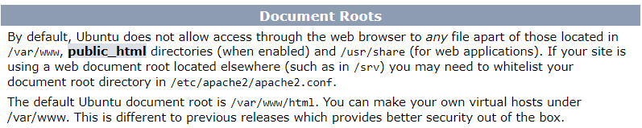

# <p align="center"> Learn how to connect and transfer files to a Linux Server </p>

<p align="center"> 
	Cloud providers provide cloud instances that act as a virtual server/computer.
</p>

<p align="center"> 
	Although there are many cloud providers, I like to go with RamNode because their server is fast and never goes down. Plus their support is great.
	You can read about how to create a RamNode instance <a href = "https://clientarea.ramnode.com/knowledgebase/4182/How-to-Create-a-Cloud-VPS-or-Instance.html">here</a>.
    I'm writing this guide mainly for myself in case I trip over a rock and forget how to connect to an instance (mainly through SSH & Command Line)
</p>

	

## Resources/Related Links:
* [RamNode | How to Create a RamNode Cloud VPS / Instance](https://clientarea.ramnode.com/knowledgebase/4182/How-to-Create-a-Cloud-VPS-or-Instance.html)
* [RamNode | How do I add an SSH key to my VPS? | SolusVM](https://clientarea.ramnode.com/knowledgebase/117/How-do-I-add-an-SSH-key-to-my-VPS-SolusVM.html)
* [RamNode | How do I connect to my VPS?](https://clientarea.ramnode.com/knowledgebase/3/How-do-I-connect-to-my-VPS-SSH.html)
* [RamNode | How to set up LAMP Stack](https://clientarea.ramnode.com/knowledgebase/114/Setting-up-a-LAMP-Stack.html)
* [Udemy   | SSH Basics for Cloud Security](https://www.udemy.com/course/ssh-basics-for-cloud-security/)
* [Github  | Connecting to GitHub with SSH](https://help.github.com/en/github/authenticating-to-github/connecting-to-github-with-ssh)
* [Forum   | How should I name SSH Keys?](https://superuser.com/questions/1247947/how-to-name-openssh-public-and-private-key-pairs#answer-1247955)
* [Youtube | Using SSH Keys to Connect to your DigitalOcean Instance](https://www.youtube.com/watch?v=plIeC5Zpp8A)
* [Amazon  | Connecting to your Linux instance using SSH](https://docs.aws.amazon.com/AWSEC2/latest/UserGuide/AccessingInstancesLinux.html)
* [Guide   | How to copy file remotely via SSH](https://www.simplified.guide/ssh/copy-file)
* [Guide   | How to set up Apache](https://linuxize.com/post/how-to-install-apache-on-ubuntu-20-04/)
* [Apache  | Docs](https://httpd.apache.org/docs/trunk/getting-started.html)

<br></br>
## <p id = "toc"> Table of Contents </p>
1. [Create SSH Keys](#ssh)
2. [Create Cloud Instance & Get Connected](#createInstance)
3. [Transfer HTML Page to Document Root](#transfer)

<br></br>
### <p align="center" id = "ssh"> Create SSH Keys | [Back to ToC](#toc) </p>
<h4>  Use SSH Keys to connect and authenticate to remote servers and services </h4>

To learn more about SSH, I strongly recommend checking out this [free Udemy course](https://www.udemy.com/course/ssh-basics-for-cloud-security/).
If you're already familiar with it, then lets begin.

First, [check your local system for existing SSH Keys](https://help.github.com/en/github/authenticating-to-github/checking-for-existing-ssh-keys).
If the keys you're looking for don't exist, you are good to go. 

> Remember that filenames for keys doesn't matter. They are only important to you, the person who manages them. The software is only concerned with the content of files. 
> [Source](https://superuser.com/questions/1247947/how-to-name-openssh-public-and-private-key-pairs#answer-1247955)

To create a key, I read [this guide](https://clientarea.ramnode.com/knowledgebase/117/How-do-I-add-an-SSH-key-to-my-VPS-SolusVM.html)
and ran the command 'ssh-keygen'. This is what output looks like when I ran the command on my system:

```
$ ssh-keygen
Generating public/private rsa key pair.
Enter file in which to save the key (/c/Users/Razat/.ssh/id_rsa):
Created directory '/c/Users/Razat/.ssh'.
Enter passphrase (empty for no passphrase):
Enter same passphrase again:
Your identification has been saved in /c/Users/Razat/.ssh/id_rsa.
Your public key has been saved in /c/Users/Razat/.ssh/id_rsa.pub.
The key fingerprint is:
SHA256:ZOEY0HBxwHcZDlsne9agOCPqV/AAN9Vn8a5fApYgOe4 Razat@DESKTOP-UK2NEC1
The key's randomart image is:
+---[RSA 2048]----+
|    +=B+=.+o+.   |
|     +o*.O+=o+   |
|      =.%.=oo o  |
|     . O = + o   |
|    .   S   + .  |
|   .   o   . o   |
|    . . E   . . .|
|     .       . o |
|              .  |
+----[SHA256]-----+
```

As you can see, the directory '/c/Users/Razat/.ssh' was created.
After this process completes, two new files will be in your ~/.ssh directory:
1) id_rsa (your private key) and 
2) id_rsa.pub (your public key).

Once you have created the keys, you will need to upload the public key to the server provider.


<br></br>
### <p align="center" id = "createInstance"> Create Cloud Instance & Connect to It | [Back to ToC](#ToC) </p>

This step is pretty easy. Go to your cloud provider & create an instance.
In my case, Ramnode has documentation for it [here](https://clientarea.ramnode.com/knowledgebase/4182/How-to-Create-a-Cloud-VPS-or-Instance.html).

> PLEASE NOTE:
> You MUST attach your SSH keys to the server instance. <br /> </br>In the last, you have successfully added your public key to the cloud provider. When you create/rebuild the instance, you will then have to select that SSH key(s) to that instance and/or enter a root password as desired.
  
<div align = "center">
    
</div>

Once you're done with that, Click 'CREATE INSTANCE' to launch a new VPS!

To check to see if your server is running, you could ping the ip address or use an IP Lookup tool [like this one](https://whatismyipaddress.com/ip-lookup).

You are now ready to connect to the server. 
Run the command 'ssh root@YOUR_IP_ADDRESS'
I ran 
```
'ssh root@168.235.86.169'
```

My output is listed below:

```
$ ssh root@168.235.86.169
Welcome to Ubuntu 20.04 LTS (GNU/Linux 5.4.0-26-generic x86_64)

 * Documentation:  https://help.ubuntu.com
 * Management:     https://landscape.canonical.com
 * Support:        https://ubuntu.com/advantage

  System information as of Sun Jun  7 06:43:08 UTC 2020

  System load:  0.71              Processes:             122
  Usage of /:   6.4% of 33.75GB   Users logged in:       0
  Memory usage: 28%               IPv4 address for ens3: 168.235.86.169
  Swap usage:   0%                IPv6 address for ens3: 2604:180:f4::f6

 * MicroK8s gets a native Windows installer and command-line integration.

     https://ubuntu.com/blog/microk8s-installers-windows-and-macos

30 updates can be installed immediately.
0 of these updates are security updates.
To see these additional updates run: apt list --upgradable


*** System restart required ***
Last login: Sun Jun  7 05:53:09 2020 from 76.90.211.216
root@generalvps:~# hostname -I
168.235.86.169 2604:180:f4::f6
root@generalvps:~#

```

There you have it. If all goes well, you have connected to your server via SSH.

Once logged in, the first thing you should do is run the command 'sudo apt-get update'.
This is my servers memory before and after running the command:

BEFORE:
```
root@generalvps:~# free
              total        used        free      shared  buff/cache   available
Mem:        1004556      180572       94780         984      729204      663852
```

AFTER:
```
root@generalvps:~# free
              total        used        free      shared  buff/cache   available
Mem:        1004556      181600      162828         988      660128      663924
```


<br></br>
### <p align="center" id = "transfer"> Transfer HTML Page to Document Root | [Back to ToC](#toc) </p>

Now that the server is up and running, we would like to host a static html page. At the moment, if we were type the clouds IP address in a browser, the server will result in an error since there is no Document Root that is created. 

Therefore, to upload file we first must know where to transfer the files and how to transfer them.

I installed Apache HTTP server on my server, so my index file was stored at /var/www/html/index.html, and can be viewed at http://168.235.86.169/

If you don't have Apache installed, try to find out where the Document Root is located on your server.
If you have Ubuntu, my Apache index file says this:

<div align = "center">
    
</div>

Once you figured out where to store the files, you will need to transfer the HTML file from your desktop to your Document Root.
You can use FTP clients like FileZilla to transfer files, but I simply used 'scp'. The command would looks something like this:

> scp /your/file/name your-ssh-gateway-user@gateway-server-host:~/

This is what my command looked like:
```
$ scp /c/Users/Razat/Desktop/ssh-transfer/index2.html root@168.235.86.169:~/
index2.html                                   100%  165     3.4KB/s   00:00 
```

When that command is complete, the file gets copied to the /root directory. Simply move the file accordingly and you should be good to go. 

You can lastly view your page at: 
> [IP Address]/[filepath(if any)]/[filename]

I was able to see my static page at a URL that looks like this:

http://168.235.86.169/index2.html

There you have it! You were able to successfully connect to a server & transfer files to it.