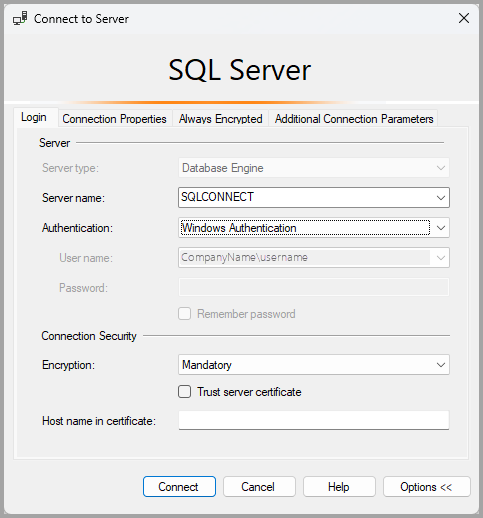
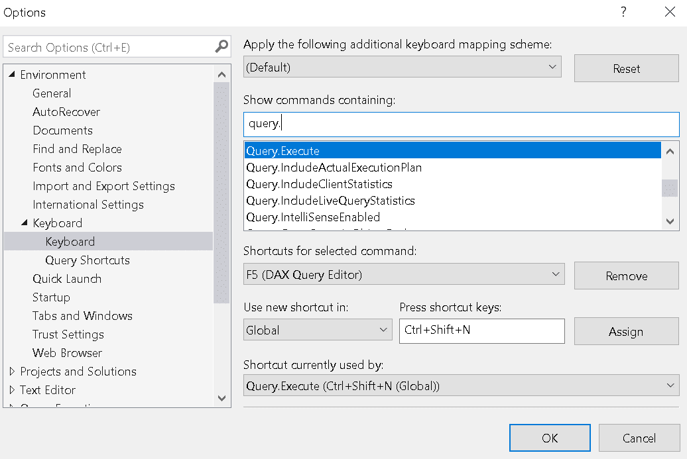
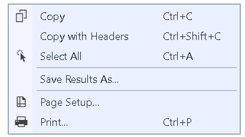
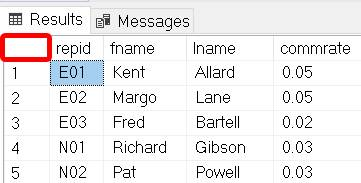
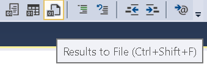

# SQL Part 1

## <p id = "toc"> Table of Contents </p>
0. [Lesson 0: Before We Begin](#0)
1. [Lesson 1: Executing a Simple Query](#1)
2. [Lesson 2: Performing a Conditional Search](#2)
3. [Lesson 3: Working with Functions](#3)
4. [Lesson 4: Organizing Data](#4)  
5. [Lesson 5: Retrieving Data from Multiple Tables](#5)  
   [Extra Lesson: Using Nested Queries](#bonus)
6. [Lesson 6: Exporting Query Results](#6)

/* -------------------------------------------------------
## <p id = "0"> LESSON 0: Before We Begin </p>
---------------------------------------------------------- */


## About the Data:  
We’ll be working with data from a publishing company that sells books to bookstores.

Please contact me to request the data.

---
### Download SQL Server Management Studio(SSMS)
SQL Server Management Studio (SSMS) is the software that lets users write and run SQL commands to talk to a SQL Server database. The tool that can be downloaded online [from Microsoft](https://www.microsoft.com/en-us/sql-server/sql-server-downloads).

```
Side Note: 
```

> SSMS is a computer application like any other. Although Windows Task Manager can be used to close SQL Server Management Studio (SSMS), reopening SSMS may cause problems. Don’t use Windows Services to start SSMS but instead, use SQL Server 20XX Configuration Manager to start the service: 
> 1. Type in 'Configuration Manager' to launch the application
> 2. Start the service for 'SQL Server' (SQL EXPRESS)
> 3. Relaunch SSMS normally.

[Stack Overflow Reference](https://stackoverflow.com/questions/35630344/unable-to-connect-to-local-sql-server-after-ending-tasks)

/* -------------------------------------------------------
## <p id = "1"> LESSON 1: Executing a Simple Query | [Back to ToC](#toc) </p>
---------------------------------------------------------- */

This chapter will cover how to use SQL Server to connect to a database and run simple queries.

### Task 1.0.1 Connecting to the SQL Database & Executing Our First Query

### 1. Launch SQL Server Management Studio:
- Click the Start button (bottom-left corner of the screen)
- Type `SQL Server Management Studio`
- Click on the application when it appears in the search list.

### 2. Connect to the Default Server
Once the application is opened, "... the 'Connect to Server' window opens. If it doesn't open, open it manually by selecting:  
'Object Explorer' > 'Connect' > 'Database Engine'." - [Source](https://learn.microsoft.com/en-us/ssms/quickstarts/ssms-connect-query-sql-server?tabs=modern)



In the 'Connect to Server' alert, click 'Connect' to connect to the server.
> Note: For local installations, typically users can sign into SQL Server with the default configuration. 

### 3. Creating a new query and execute a statement.

1. Once authenticated in SQL Server, press `CTRL + N` to launch a new query. 
2. In the query editor window, type in a simple statement:  
``` SELECT 1+3 ``` 
3. Below are different ways to execute the query:  
	- Shortcuts: F5, Ctrl + E, Alt + X  
	- Click the green 'Execute' button on the toolbar.  
	- Go to Query (tab) -> Execute.  
	- Right-click anywhere in the query window and choose 'Execute SQL' from the context menu.  

> NOTE: T-SQL is a Declarative language (i.e. the user defines the result) that also supports some precedural syntax, which will be discussed in SQL Part 2.

### The main parts of the SSMS interface are the:
- Object Explorer: Navigate through databases, tables, views, stored procedures, etc. 
    - This pane can be hidden/unhidden if needed.
- Query Editor: Write and run SQL queries.
- Results Pane: Ctrl + R - Toggles the results pane

### Task 1.0.2 Show Lines in the Query Editor
Displaying line numbers in the query editor makes it easier to pinpoint and debug errors, which can lead to improved collaboration in code reviews and screen sharing. 

To show line numbers:
``` 
	1. Go to Tools > Options 
	2. Expand 'Text Editor' -> Transact-SQL -> General. 
	3. Check the Line numbers box and click OK
```

<br />

## Lesson 1.1 Additional Simple Queries

### SQL Comments
Comments are used explain SQL code or add notes for the reader. They are ignored by the database engine and are not executed.

#### Example: Write a basic SQL query and include a comment via the use of -- 
``` sql
-- Two -'s are used to write a single-line comment.  
-- Text after -- is ignored to the end of the line.
SELECT 1+3 -- Output: 4
```

### SQL Multi-line Comments
Multi-line comments begin with /* and end with */. Any text between them is ignored.

#### Example: Write a basic SQL query and include a comment via the use of -- 
``` sql
/*  
	The 
	query 
	below 
	outputs 
	4.
*/
SELECT 1 + 3
```

---

In SQL Server, including multiple SELECT statements in a single query batch will return their own result sets.

Note that the SQL parser ignores extra whitespace, tabs, and line breaks.

#### Example: Write a batch of SQL statements: 
``` sql
SELECT 1+3

-- extra spaces can be used as long as they doesn't break any words.

SELECT 'Have a nice day'  	-- Outputs simple text. 
SELECT 'Thank you!'			-- Notice the use of single quotes, as the use of double quotes will result in an error.
PRINT 'Good Bye!' 			-- Displays a message or a value in the 'Messages' tab and is mainly used for debugging.
```

---

SQL Server provides built-in functions that format how data is displayed and can perform calculations e.g. rounding values.
#### Example: Demonstrate the power of the functions.
``` sql
SELECT FORMAT(1+3, 'C')  -- Output: $4.00, since FORMAT Function converts the number into a string. 'C' stands for Currency.
SELECT FORMAT(123.490000000, '0.##')	-- Output: 123.49
SELECT ROUND(235.415, 2) AS RoundValue;	-- Output: 235.420 
-- Note: MS Excel has a round function too 
-- = ROUND(D2,0) -- given that D2 = 235.415
```

---

## Lesson 1.2. Selecting Data from a Database

#### Task 1.2.1: Return all data from the `Slspers` table:  
``` sql
USE Pub1  
SELECT *  	 -- Selects ALL columns
FROM slspers -- Note: Spelling matters. Typing 'slsperson' won't execute.
```

> In SQL Server, a SELECT query can <i>also</i> be made from the Object Explorer:  
> Right-click the table name and choose 'Select Top 1000 Rows'.

#### Optional Task 1.2.2: Retrieve the data from the other 3 tables:  
``` sql
SELECT * FROM Customers  
SELECT * FROM Titles  
SELECT * FROM Sales  
```

Queries can also be written to output individual columns.  

#### Task 1.2.3 Output the first and last names of everyone in the `Slspers` table.
``` sql
SELECT fname, lname  
FROM slspers;
```

SQL is generally whitespace-insensitive, meaning that extra spaces, tabs, or newlines between keywords and identifiers (names) are ignored by the parser.
``` sql
-- Output the first and last names of everyone in the `Slspers` table.
SELECT 

	fname, 
	lname  -- Note there is no comma after "lname".

FROM slspers;
```


## Lesson 1.3. SQL Prefixes & Aliases
A prefix can be used in front of a column or even table name to specify its source and avoid ambiguity

``` sql
-- `Slspers` is a table prefix for the column `fname`
SELECT  
	Slspers.fname, 
	Slspers.lname  
FROM Pub1.Slspers;
```

Note that table prefixes can also be used before the wildcard asterisk (*).
``` sql
SELECT Slspers.* FROM Slspers    
-- Same as:  
-- SELECT * FROM Slspers
```

#### Alias 'AS' Keyword 
In SQL, aliases are used to give a table or a column a temporary name and are useful when renaming long or confusing column names

``` sql
SELECT 
	fname AS [First Name], 
	lname AS 'Last Name' 
FROM Slspers; 
```

NOTE: The keyword 'AS' is not needed since it's just a formality.  
``` sql 
SELECT 
	fname, 
	lname 'Last Name',  -- Two-word Alias must still be wrapped in single quotes.
	commrate Rate		-- One-word Alias do not need quotes.   
FROM Slspers; 
```

#### ...more to discuss in Chapter 5! [Link to Lesson 5](#5). 

---

## Lesson 1.4. Calculated/Derived columns
In SQL, a new "calculated" column can be added to the query result by using a fixed value or calculation. This column appears ONLY in the results and is neither stored nor affect the actual table.

``` sql
SELECT 
	fname, 
	lname, 
	'United States' AS Country, 
	'21' AS Age  
FROM Slspers
```

Additionally, the ROUND() function can be used to round a column of numbers to however many decimal places needed.
``` sql
SELECT  
	slprice,  
	ROUND(slprice,0) -- Round to nearest number  
FROM Titles
```

ADVANCED: To create a new rounded column stored in the table:
``` sql
ALTER TABLE Titles
ADD RoundedPrice INT;

UPDATE Titles
SET RoundedPrice = ROUND(slprice, 0);
```

Another Example:
``` sql
SELECT  
	partnum,   
	bktitle,  
	slprice,  
	slprice * 1.2 AS slprice_inflation,       

	-- To Remove trailing 0's without rounding:  
	FORMAT(slprice * 1.2, '0.##') AS discounted_price, -- Good Solution:	0's removed, but some prices only have whole dollars   
	CAST(slprice * 1.2 AS DECIMAL(10,2)) AS Inflation  -- Better Solution:	Force two decimal places everywhere.
FROM Titles
```


> Remember: A calculated column doesn't exist in a table, yet SQL will calculate the function for each row when the query runs. 

## Lesson 1.5. Keyboard Shortcuts

### Below are some handy keyboard shortcuts:
- Ctrl + R (Hide the Result Pane)

<br/>  

- Ctrl+K; Ctrl+C (comment)  
- Ctrl+K; Ctrl+U (uncomment)  

<br/>

- CTRL + Shift + U (Uppercase)  
- CTRL + Shift + L (Lowercase)

--- 

### Customized Shortcut Keys
Custom keyboard shortcuts can be created for useful commands e.g. executing queries. To create a custom shortcut:  
1. 	Go to Tools -> Options
2. 	Navigate to:
	Environment → Keyboard
3.  In 'Show commands containing', search for: `Query.Execute` & click on it
4.  Under 'Press shortcut keys', press the desired combination (e.g., Ctrl + Shift + N)
5.  Click Assign, then OK



---

## Lesson 1.6. Column Settings & Table Structures
MS SQL Server holds many stored procedures that act as a saved set of SQL commands

For instance, to display a table structure:  
```
SP_HELP Slspers  
```

Upon running the above procedure, notice that each column has a data type. Data Types are Column Types which are a columns attribute/definition that determines the kind of values the column can hold. Every column in a SQL table is required to have a specific Data Type assigned to it.

- Data types are constraints that specifies what kind of values a column can store and more importantly, what it cannot! For example, a column defined as a `DECIMAL` data type will contain only decimal numbers, so it enforces data validation since we wouldn't expect to see that column to hold some other value e.g. a date.
- This will be discussed more in Lesson 3 of SQL Part 2.

Additionally, in the Object Explorer, right-click on the table of choice and click 'Design' to view and modify the table’s structure.

``` sql 
-- Albeit advanced, the below command also outputs column names  
SELECT COLUMN_NAME  
FROM INFORMATION_SCHEMA.COLUMNS  
WHERE TABLE_NAME = 'Slspers'
```

## Lesson 1.7. Backup Tables
A backup table is a copy of a table that’s useful for testing queries on sample data. It's important to note that it's not good practice to create duplicate tables unless for testing purposes, sandboxes & overall backups.

``` sql
-- Excercise: Create a Backup table
SELECT *  
INTO Slspers_Backup  
FROM Slspers;  
```

Once the command is executed, the table can be viewed by:  
1. First refreshing the Object Explorer by clicking the  'Refresh (F5)' button.  
2. Hide the folder 'Tables' & expand the folder again.  

When creating a new table, IntelliSense may not recognize the table name right away and can display a red squiggly line which indicates that the name is an invalid object name. To refresh the IntelliSense cache, do one of the following:

- Press 'Ctrl' + 'Shift' + 'R' OR
- On the toolbar, navigate to 'Edit' -> 'IntelliSense' -> 'Refresh Local Cache'.

Albeit advanced, a 'NewCustomers' table can be created but with structure only  
``` sql
SELECT *  
INTO NewCustomers  
FROM Customers  
WHERE 1 = 0;  
-- To create an empty table (structure only),   
-- use WHERE 1 = 0 or similar condition.
```

To delete a table, either:  
- Right-click the table name in Object Explorer and select 'Delete'.
- Run the following code:
	``` sql
	DROP TABLE IF EXISTS Slspers_Backup 
	-- Note: This will PERMANENTLY delete the table unless either a backup has been stored or the changes haven't been committed yet!  
	```  
 


Lastly, to truncate a table i.e. to remove all rows from a table:   
``` TRUNCATE TABLE Slspers_Backup ```

This content will be covered more extensively in the SQL Part 2 class.

---

## Lesson 1.8. The Command Line
The command line can be used to run T-SQL. 

1. Open Command Prompt & type the following to connect to SQL Server: (Note: The server name will need to be changed)  

		sqlcmd -S UT-LAPTOP\SQLEXPRESS -E

2. Once connected, a prompt will show: 
``` 1>.``` 

3. Type in a SQL statement e.g. ``` SELECT 1 + 2 ```
4. Type: `GO` which will tell SQL Server to run the command.
5. BONUS: To use a database and see data:
	```
	USE Pub1;
	SELECT * FROM Slspers;
	GO
	```

Full Example:
```
C:\Users\student> sqlcmd -S UT-LAPTOP\SQLEXPRESS -E  
1> select 1 + 2;  
2> GO  

1> USE Pub1;  
2> SELECT * FROM Slspers;  
3> Go  
```

If a SQL Script has been saved, it can also be executed from the command line:
```
sqlcmd -S UT-LAPTOP\SQLEXPRESS -E -i "C:\Users\student\Documents\SQL Script Command Line\SQLQuery.sql"
```

/* -------------------------------------------------------
## <p id = "2"> LESSON 2: Performing a Conditional Search | [Back to ToC](#toc) </p>
---------------------------------------------------------- */

In the last chapter, a connection to a server was made and a few basic queries were executed.  This chapter will cover how to sort & filter results to reorganize and display only the data needed.

In other words, this chapter will cover sorting & filtering.

## Lesson 2.1. Sorting with 'ORDER BY' Clause
Sorting organizes query results in ascending or descending order.

#### Task 2.1.1. Example: Sort data by a single column:  
``` sql
SELECT *  
FROM Customers   
ORDER BY state ASC -- Sorts the table by state column  
-- IN SQL SERVER, ORDER BY defaults to ASC.  
```

A multi-level sort can be applied by listing column names in sequence and separating them with commas.

#### Task 2.1.2. Example of a Multi-Level Sort:  
``` sql
SELECT *  
FROM Customers  
ORDER BY state ASC, city DESC, custname ASC    
-- This means that the customer data is sorted first by State, and if some records share the same State, those records are then sorted by City.  
-- For those customers in the same city, those records are then further sorted by name.
```

### `SELECT TOP` clause
The `SELECT TOP` clause limits the number of records returned. It is especially useful for large tables, as retrieving too many records can slow performance.

#### Task 2.1.3.: Select only the top 5 rows of the Customers Table:  
``` sql
SELECT  
TOP 5  
*  
FROM Customers  
ORDER BY State ASC
```

-- In SSMS, the 'Query Options' command can be used to set the ROWCOUNT value.  
-- i.e. 'Specify the maxinum number of rows to return before the server stops processing'


## Lesson 2.2 Filtering with 'Where' Clause
The SQL WHERE clause filters results by applying one or more conditions so that only records that meet the criteria are returned (or affected). A condition is a rule for finding specific data and consists of a column (or expression), an operator, and a value to compare.

#### Task 2.2.1. Simple Example of Where Clause
``` sql
SELECT *  
FROM Customers  
WHERE state = 'NY'   
-- The WHERE clause acts as a Filter. Verify that 6 people are returned.  

-- NOTE: In SQL Server, use single quotation marks (' ') for string literals.  
-- Double quotation marks (" ") are not valid for this purpose and will not work in a query.
```

> Practice Exercise: Show all people from the city 'Houston'.

Below are more examples demonstrating various ways the WHERE clause can be used:  
- WHERE clause used with numbers:
	``` sql
	-- Another Example  
	SELECT *  
	FROM  titles  
	WHERE  
	-- NOT  
	slprice      >            50  
	column    operator       value
	```

- WHERE clause used with showing book titles with dates past 1/1/2017
	``` sql 
	SELECT 
		bktitle, 
		CAST(pubdate AS DATE) -- CAST is used to truncate the time portion  
	FROM Titles  
	WHERE pubdate > '2017-01-01' -- Note: Date must be wrapped in ''  
	ORDER BY pubdate
	```

- BE CAREFUL: Computed or alias columns aren't part of the actual table, so they can't be used in the `WHERE` clause since WHERE is evaluated before SELECT.
	``` sql
	SELECT  
		partnum,  
		bktitle,  
		slprice - slprice * 0.07 AS discounted_price  
	FROM Titles  
	WHERE slprice - slprice * 0.07 >= 45  
	-- WHERE discounted_price >= 45 -- WON'T WORK!  
	ORDER BY discounted_price DESC  -- WILL WORK!  
	```

- WHERE Clause used with creating a new table from a filter:
	``` sql
	SELECT *  
	INTO CA_Customers  -- Creates a new table called 'CA_Customers'  
	FROM Customers  
	WHERE state = 'CA'  
	```

	- TO DELETE:  
	``` DROP TABLE CA_Customers ```  

- Another Example  
	``` sql
	SELECT *  
	INTO HighEarners  
	FROM Slspers  
	WHERE commrate > 0.04;  
	```

### 2.3. Additional Keywords

### SQL NOT Operator 
The NOT operator is used in the WHERE clause to return records that do not match a specific condition.

#### Exercise: Returns all customers NOT from NY:
``` sql
SELECT *  
FROM Customers  
WHERE NOT state = 'NY'    
-- ORDER BY state  
```

The <> operator can be used in lieu of the `NOT` keyword. 
#### Task 2.3.1: Using `<>`, returns all customers NOT from NY:
``` sql
SELECT *  
FROM Customers  
WHERE state <> 'NY'
-- ORDER BY state   
```

### NULL Values
In SQL, a `NULL` value represents void or empty data in a table field. Similar to a blank cell in Excel, in databases a `NULL` value is a placeholder that represents missing or blank data, and is different from a numeric zero or an empty string.

#### Task 2.3.2 Example of WHERE clause with NULL:  
``` sql
SELECT *  
FROM Titles  
WHERE devcost IS  
-- NOT  
NULL  
```

### Below is a bonus exercise using ISNULL():

Additionally, ISNULL() is a function that replaces `NULL` values with an alternate value. This function is similar to the Excel function ' IF( ISBLANK() ) '  
> Note: In MySQL, use the function IFNULL() instead.

For example, if a table looked like this:
```
Name	Bonus  
Alice	1000  
Bob		NULL  
Charlie	500  
```

Running the following query will replace null values with 0:  
``` sql
SELECT Name, ISNULL(Bonus, 0) AS BonusAmount  
FROM Employees;
```

Result:
```
Result:  
Name	Bonus  
Alice	1000  
Bob		0  
Charlie	500  
```

Advanced: To permanently update all `NULL` values with a generic statement:
``` sql
UPDATE Employees
SET Bonus = 0
WHERE Bonus IS NULL;
```

### AND Operator
The AND operator displays a record if all the searched conditions are TRUE.

> Remember: EVERY (All) condition MUST be true. [Similar to Excel Function]

Exercise: Show only customers from Denver, CO since there are multiple Denver cities in America.
``` sql
SELECT *  
FROM customers  
WHERE state = 'CO' AND city = 'Denver'  
```

1 MIN Optional Exercise: Show all customers that live in NY but NOT in the city of Buffalo.
``` sql
SELECT *  
FROM customers  
WHERE state = 'NY' AND NOT city = 'Buffalo'
```

Exercise: Show all sales records made by sales representative 'N02' where the quantity sold is greater than 200
``` sql
SELECT *  
FROM sales  
WHERE repid = 'N02' AND qty > 200  
ORDER BY qty 
```

Exercise: Show all book titles whose sales price is between $30 & $40.
``` sql
SELECT *  
FROM Titles  
WHERE slprice >= 30 AND slprice <= 40  
-- Also works: WHERE slprice BETWEEN 30 AND 40 -- does the same as above.  
ORDER BY slprice ASC
```

1 MIN Optional Exercise: Show all book titles that have a sales price between $30 and $40 and have a
defined (a.k.a. known) development cost.
``` sql
SELECT *
FROM Titles
WHERE slprice BETWEEN 30 AND 40 
AND devcost IS NOT NULL
```

### OR  

> Remember: ONE/ANY condition MUST be true. [Similar to Excel Function]

Exercise: Show all customers who are either in California or New York. 
``` sql
SELECT custname, city, state 
FROM Customers    
WHERE state = 'CA' OR state = 'NY'    
-- Also works: -- WHERE state IN ('CA', 'NY', 'TX');  
```

#### Activity 2.3: Find the Problem:
Q: Show me people who live either in NY or CA. Amongst those people, they MUST have a zipcode of 92704.

``` sql
SELECT *  
FROM Customers  
WHERE Customers.state = 'NY' OR state='CA' AND zipcode = '92704'  
ORDER BY zipcode  
-- This will return multiple NY resident without the zipcode 92704  
-- This is because in a SQL query, the AND operator has a higher precedence than the OR operator and is evaluated first

-- Proper Solution: 
-- WHERE (Customers.state = 'NY' OR state='CA') AND zipcode = '92704'  
```

## Lesson 2.4. omg LIKE finding data based on patterns
The `LIKE` operator is used in a `WHERE` clause to search for data based on a string pattern.

Exercise: Get all customers whose name starts with the letter 'A'  
``` sql
-- Solution
SELECT *  
FROM Customers  
WHERE custname LIKE 'A%';
```

Optional Exercise: Show all customers that end with the letter 's'
``` sql
-- Solution:
SELECT * 
FROM Customers
WHERE custname LIKE '%s';
```

Optional Example #1: Show all customers that only begins with the word 'The'
``` sql
-- Solution
SELECT *
FROM Customers
WHERE custname LIKE 'The%'
```

Optional Example #1: Show all book titles that contains the word 'The'
``` sql
-- Solution
SELECT *
FROM Titles
WHERE bktitle LIKE '%The%' 
```

#### EXACT MATCH  
``` sql
SELECT * FROM Titles  
WHERE bktitle = 'Sailing' -- filters rows
```

VS.
 
#### CONTAINS MATCH
``` sql
SELECT * FROM Titles  
WHERE bktitle LIKE '%B%'  -- Show all books that contain the letter B
-- Also works: -- WHERE bktitle LIKE '%[B]%' 
```

The following 3 filters are all the same: 
``` sql
SELECT bktitle  
FROM Titles   
-- The following 3 filters are all the same:  
-- WHERE bktitle LIKE '[ABC]%' -- Replacing '[ABC]%' with '[ABR]%' only shows titles beginning with A, B, or R  
-- WHERE bktitle LIKE '[A-C]%' -- Brackets is a must; Returns titles with books that begin A-C  
-- WHERE bktitle LIKE '[A]%' OR bktitle LIKE '[B]%' OR bktitle LIKE '[C]%'  
-- WHERE partnum LIKE '401__' -- underscore represents 1 character  
ORDER BY bktitle ASC  
```


/* -------------------------------------------------------
## <p id = "3"> LESSON 3: Working with Functions | [Back to ToC](#toc)</p>
---------------------------------------------------------- */

Database functions are reusable expressions (blocks of code) used in SQL queries to compute and return values.

There are many built-in SQL functions that are similar to Excel functions (e.g., `SUM` and `CONCATENATE`), and users can also create their own custom functions (which will be discussed in Part 2).


## Lesson 3.1 Date Functions

To get todays date:
``` sql
SELECT GETDATE();  -- Similar to Excels NOW() function. 
SELECT CAST(GETDATE() AS DATE);  -- Similar to TODAY() function
```

> Note: Please do not forget to include parentheses when working with functions.

Please note that column names can be wrapped in parentheses. This is similar to referencing a cell in Excel using `=A1` or `=(A1)`

Exercise: Column Names Using Parenthesis:
``` sql
SELECT
	bktitle, 
	(bktitle), -- Column name works with or without ()
	(slprice * 0.9),  -- Formulas can use () but are not required.

	(pubdate),  
	CAST(pubdate AS Date) AS 'New Pub Date'
FROM titles
```

Similar to Excel, SQL can use:  
* the `YEAR` function to ouput the current year:

``` sql
	SELECT YEAR( GETDATE() );  -- Excel Equivalent Function: = YEAR( TODAY() )  
	-- in SQL, this also works: 
	-- SELECT DATEPART( year, GETDATE() )	
```

* the `MONTH` and `DAY` functions too.
``` sql
	SELECT MONTH( GETDATE() )
	SELECT DAY( GETDATE() )
```

<br/>

#### Exercise: Filter By The Year 2017
``` sql
-- Example: Filter by 2017  
SELECT  
	bktitle,  
	pubdate  
FROM Titles  
WHERE YEAR(pubdate) = 2017  -- Filter by 2017  
ORDER BY YEAR(pubdate), MONTH(pubdate)
```

#### Recap:
``` sql
SELECT  
	bktitle,   
	pubdate,  
	YEAR(pubdate) -- Use the Year function to return YEAR of each record.  
FROM Titles  
WHERE YEAR(pubdate) = 2017  -- Filter by 2017  
-- Same as: -- WHERE DATEPART(year, pubdate) = 2017  
```

#### 1 Min Optional Exercise: Filter for months between May through Oct  
``` sql
SELECT  
 	bktitle, CAST(pubdate AS DATE)  
FROM Titles  
WHERE MONTH(pubdate) BETWEEN 5 AND 10  
```

#### 1 Min Optional Exercise: Show booktitles published on July 2016
``` sql
-- Solution:  
SELECT  
	bktitle, CAST(pubdate AS DATE)  
FROM Titles  
WHERE YEAR(pubdate) = 2016 AND MONTH(Pubdate) = 7  
ORDER BY pubdate
```

#### 1 Min Optional Exercise: Show titles published in 2016 or 2017
``` sql
-- Solution 1:
SELECT
	bktitle, CAST(pubdate AS Date) AS 'New Pub Date'
FROM Titles
WHERE YEAR(Pubdate) = 2017 OR YEAR(Pubdate) = 2016

-- Solution 2:
SELECT
    bktitle,
    CAST(pubdate AS DATE) AS [New Pub Date]
FROM Titles
WHERE YEAR(pubdate) IN (2016, 2017)
ORDER BY pubdate
```

#### This query below lists publication date, and extra columns depicting the next day, and one year later.
``` sql
SELECT  
	pubdate,   
	pubdate + 1 AS next_day,  
	DATEADD(YEAR, 1, pubdate) AS Pub_Deadline -- Adds 1 year later to the publication date.  
FROM Titles  
WHERE pubdate BETWEEN '1/1/1994' AND '12/31/2013'  
```


## Lesson 3.2. Aggregate Functions
"An aggregate function in the Microsoft SQL Database Engine performs a calculation on a set of values, and returns a single value."  
— [Microsoft Learn: Aggregate Functions](https://learn.microsoft.com/en-us/sql/t-sql/functions/aggregate-functions-transact-sql?view=sql-server-ver17)

The `COUNT` Function returns the total number of rows in a table, including those with NULL values.
``` sql
SELECT	
	COUNT(*),  
	COUNT(DISTINCT pubdate) AS distinct_publish_dates  -- Count UNIQUE publish dates.
FROM	TITLES  
WHERE 	YEAR(pubdate) = 2017  
```

Below is a query that uses a few common aggregate functions:
``` sql
SELECT  
	SUM(devcost),  
	AVG(slprice),  
	AVG(slprice * 0.9) AS AVERAGE_DISCOUNT_PRICE,  
	MAX(slprice) Highest_Price,  --  Note: AS keyword is dropped  
	MIN(slprice) Lowest  
FROM Titles  
WHERE YEAR(pubdate) = 2017  
```

<br />

```
*** REMEMBER: ***  
```

If only aggregate functions are used, then only one resulting row will produce.
Once a non-aggregated column is added in the `SELECT` query, a `GROUP BY` clause is required to define how rows are grouped (See Chapter 4).

In other words, combining row-level fields (like `bktitle`) with aggregated values (such as `COUNT` or `AVG`) requires specifying how to group the rows in SQL; otherwise, it will produce an error.

``` sql
SELECT  
	COUNT(*),   
	SUM(devcost),  
	AVG(slprice),  
	MIN(slprice),  
	MAX(slprice)  
	-- bktitle -- will run an error because it's not an aggregate function  
FROM Titles  
WHERE DATEPART(year, pubdate) = 2017  
```

---
<br/>

``` sql
-- Notice the difference between answers
SELECT AVG( CAST(commrate AS DECIMAL(10,1)) ) FROM Slspers  -- 0.030000
SELECT AVG( CAST(commrate AS DECIMAL(10,2)) ) FROM Slspers  -- 0.037000
```

> Side Note: If a SQL column is stored as a TEXT but contains numbers, the column must then be casted to a numeric type before doing numeric operations or comparisons.

---
<br /> 

Q: Can a sum function be used across a row?

Short answer:  
No, the `SUM()` function can't be used to add values across columns like `Q1 + Q2` in a single total row.  
`SUM()` works vertically by adding values in one column over many rows

However, a calculated column can perform a row-wise sum across columns (e.g. manually adding columns Q1 + Q2) without using a specific function:

``` sql
SELECT 
    id,  
    Q1,  
    Q2,  
    Q1 + Q2 AS Total  
FROM sales;  
```

<br /> 

--- 

### 3.2.2. Nested Queries

A nested query is a query placed inside another query. The inner query (subquery) gets evaluates first and provides data to the outer query, which can be used in the SELECT, FROM, or WHERE clauses. Subqueries are written in parentheses and act as additional  queries i.e. nested queries can be formed by wrapping `SELECT` queries in parenthesis (Similar to a Nested Function in Excel)

#### Task: Show all salespersons whose commission rate is above average

#### Query 1 - Show all salespeople whose commission is higher than a fixed value.
``` sql
SELECT * From Slspers  
WHERE commrate > 
0.02  
-- ORDER BY commrate DESC  
```

#### Query 2 - Show the average commission rate for all salespeople listed.
``` sql
-- Remember: Extra Spaces are ignored.
(  
SELECT AVG(commrate) FROM Slspers -- RESULT: 0.037  
)  
```

#### Query 3 (Combined)
> Combining the last 2 queries together...  

``` sql
-- Show all salespersons whose commission rate is above average.
SELECT * FROM Slspers  
WHERE commrate > 
( SELECT AVG(commrate) From Slspers )  -- Inner query gets evaluated first.
-- ORDER BY commrate DESC  
```

#### Optional Subquery Demos
Optional Demo #1: Show all books that are of the maximum salesprice:
``` sql
SELECT *
FROM Titles
WHERE slprice = (
    SELECT MAX(slprice)
    FROM Titles
)
```

Optional Demo #2: Show all titles that are cheaper to develop than the cheapest obsolete title

```sql
SELECT *
FROM Titles
WHERE devcost < (
	SELECT MIN(devcost)
	FROM Obsolete_Titles
)
ORDER BY devcost DESC
```

> Alternatively, the `ALL` modifier could have been used.  
> Note: In SQL Server, using `MAX()` or `MIN()` is generally faster and more efficient than using `ALL`.

```sql
SELECT *
FROM Titles
WHERE devcost < ALL (
	SELECT devcost
	FROM Obsolete_Titles
)
```

- `ALL` compares a value to every value returned by the subquery
- In this case, it returns rows where `devcost` is less than *every* value (i.e., less than the minimum)

---

## Lesson 3.3. String Functions
A `string` refers to text data in a SQL table. It's anything made of characters (e.g. letters, numbers, symbols) and are usually written inside single quotes. Below are some examples:

```
'hello'
'John  123'
'2026-04-17'
```

Therefore, SQL string functions are functions that work with text data. They help clean, format, and extract information from strings like names and addresses, making data easier to organize and analyze.

#### TRIM Function  
Similar to [the Excel Function](https://support.microsoft.com/en-us/office/trim-function-410388fa-c5df-49c6-b16c-9e5630b479f9), the TRIM() function removes leading & trailing spaces from text. 

``` sql
SELECT TRIM('      I love SQL   ') AS Result  -- Output: I love SQL (No Leading or Trailing Spaces)
-- Note the use of single quotes above.
```

Note: Use the `REPLACE` function to swap every space character with an empty string
``` sql
SELECT REPLACE('   I   love   SQL   ', ' ', '') AS Result -- Output: IloveSQL (No Spaces)
```

#### Exercise: Output the City, State from the Customers Table as a single column.
``` sql
SELECT   
	city + ', ' + state,  
	-- Original Data: 	-- Rochester           , NY  

	TRIM(city) + ', ' + state  
	-- Solution: 		-- Rochester, NY
FROM CUSTOMERS
```

> NOTE:  The TRIM function does not automatically apply to all columns in a table i.e. you must specify each column  to trim.

#### Optional Excercise: Create a column that contains the full address from the Customers table 

```sql
-- Solution:  
SELECT 
    Custname, 
    TRIM(Address) + ', ' +  
    TRIM(City) + ', ' +  
    TRIM(State) + ', ' +  
    TRIM(Zipcode)  
  AS Address  
FROM Customers;
```

#### CONCAT Function
Similar to [the Excel function](https://support.microsoft.com/en-us/office/concat-function-9b1a9a3f-94ff-41af-9736-694cbd6b4ca2), the CONCAT() function combines two or more text values into one text string.

Exercise: Use the CONCAT() function to combine the customer name and city into one column.
``` sql
SELECT 
	CONCAT(Custname, ' lives in ', City) AS CustomerInfo
FROM Customers;
```

#### 2 MIN Exercise #1: Create a 'Full Name' column by concatenating Last Name, First

``` sql
-- Solution 1:
SELECT   
	TRIM(lname) + ', ' + fname AS 'Full Name' 
FROM Slspers

-- Solution 2:
SELECT   
	CONCAT(TRIM(fname), ' ', lname) AS full_name  
FROM Slspers
```

#### LOWER Function
Similar to [the Excel function](https://support.microsoft.com/en-us/office/lower-function-3f21df02-a80c-44b2-afaf-81358f9fdeb4), the LOWER() function changes all uppercase letters in a text string to lowercase.

#### Exercise: From the previous example, convert the concatenated text to lowercase 
``` sql
-- Solution:  
SELECT   
	LOWER(  
		CONCAT(TRIM(fname), ' ', lname)  
	) AS Full_Name  
FROM Slspers;
```

#### 2 MIN Exercise: Exercise 2: Create a fake email for each salesperson by using the format: `fname.lname@outlook.com`

``` sql
-- Solution:  
SELECT  
	LOWER(
		TRIM(fname) + '.' + TRIM(lname) + '@outlook.com' 
	) 
FROM Slspers  
```

#### LEFT Function
Similar to [the Excel function](https://support.microsoft.com/en-us/office/left-function-9203d2d2-7960-479b-84c6-1ea52b99640c), the LEFT() function returns a specified number of characters from the start of a text string.

### Demo: Output the word 'pine' from 'pineapple'
``` sql
SELECT LEFT('Pineapple',4) AS Result
```

#### Exercise: Get the initials for each sales rep.
``` sql
SELECT 
	fname,
	lname,
	LEFT(fname,1) + '.' + LEFT(lname,1) + '.' AS Initials
FROM Slspers
```

#### (DEMO BONUS) Exercise: Write a SQL query to create a lowercase email for each row in Slspers e.g. jsmith@outlook.com
``` sql
-- Returns the First Letter of First Name + Last name + '@outlook.com'
SELECT 
	fname, lname,
	LOWER(
		LEFT(fname, 1) + TRIM(lname) + '@outlook.com'
	) AS email
FROM Slspers
```

#### Optional Bonus: Substring Function
SQL Servers SUBSTRING() function extracts a specific number of characters from a text string. Similar to Excels `MID` function, it contains three input arguments:
* The text string containing the characters to extract
* Starting_Position which is the position of the first character to extract
* Length which specifies the number of characters to return.

Optional Task: Output the term 'qpp' from the text 'Pineapple'
``` sql
	SELECT SUBSTRING('Pineapple',5,3)
	-- Excel Equivalent Function: 
	-- = MID("Pineapple",5,3)
```

/* -------------------------------------------------------
## <p id = "4"> LESSON 4: Organizing Data | [Back to ToC](#toc)</p> 
---------------------------------------------------------- */

This lesson will cover how to group query results to better summarize and understand data better.

## Lesson 4.1. Counting, Ordering & Ranking Data
#### Recall that the COUNT() function returns the total number of rows in a table:
``` sql
SELECT COUNT(*)  
FROM Slspers;  
-- in SSMS, Clicking on 'Messages' will display output of Count of Rows as well.
```

#### The query below shows row #'s for each row i.e. show rows as a seperate column:
``` sql
SELECT  
	ROW_NUMBER() OVER (ORDER BY repid) AS row_num,  	
	*  
FROM Slspers
```

DENSE_RANK() is a window function that assigns a unique rank to each row within a result set.
[Source](https://learn.microsoft.com/en-us/sql/t-sql/functions/dense-rank-transact-sql?view=sql-server-ver17)

``` sql
SELECT  
  fname, 
  commrate,  
  DENSE_RANK() OVER (ORDER BY commrate DESC) AS SalaryRank  
  -- DENSE_RANK uses consecutive ranks that doesn't skip ranks after ties.  
FROM Slspers  
ORDER BY commrate ASC;
```

#### X X X Unpreferred X X X
RANK() assigns the same rank to tied values.  
It skips ranks for ties (that's why there’s no rank 2,3).  

``` sql
SELECT  
  fname,  
  commrate,  
  RANK() OVER (ORDER BY commrate DESC) AS SalaryRank  
FROM Slspers
ORDER BY commrate ASC;
```

<br /> 

--- 

## Lesson 4.2. Group By  
The GROUP BY statement combines duplicates values into unique groups i.e. the GROUP BY statement creates a vertical list of unique categories.

> In terms of logic, the GROUP BY clause is similar to what a Pivot Table does.

Grouping data helps summarize, analyze & understand data more easily, such as viewing total sales by region or city.

#### Output each distinct customer (like Excel's UNIQUE() function)  
``` sql
SELECT DISTINCT City  
FROM Customers  
```

> Notice in the above example the unique list of customers.

Use the GROUP BY statement to achieve the same results.  
``` sql
SELECT city  
FROM Customers  
GROUP BY city  
```

#### To add a column of the count of each city:
``` sql  
SELECT city, COUNT(city)  
FROM Customers  
GROUP BY city  
```

> Practice: Group the data by state & add a column of the count of each state,

#### Demo Exercise: For each sales person, show the number (qty) of books sold
``` sql
-- Solution (Keep this query since we'll build off this soon)
SELECT  
	repid,  
	SUM(qty) AS qty_Total   
FROM sales  
-- WHERE YEAR(sldate) = 2012  
GROUP BY repid  
-- ORDER BY repid
```

#### Demo Exercise: List each commission rate along with the number of salespeople who have that rate.  
``` sql
SELECT	
	commrate,  
	COUNT(commrate) AS number_salespeople,  
	STRING_AGG(TRIM(fname), ', ') AS salespeople   
	-- A column that uses the string aggregation function aggregates the first names of salespeople into a list or array  
FROM Slspers  
GROUP BY commrate
```

## Lesson 4.3. HAVING Clause
The HAVING clause filters results after they have been grouped (not before!).

```
Remember the Acronym: (Huge Shoutout to Alice Zhao)  
Start 	Fridays With 	Grandmas Homemade 	Oatmeal  
SELECT 	FROM 	WHERE 	Group By Having 	Order By
```

#### Demo Exercise: Show a count of titles released per year BUT only show years with more than 5 titles released.
``` sql
SELECT 
	YEAR(pubdate), 
	COUNT(*) -- Also works: -- COUNT(pubdate)  
FROM Titles  
GROUP BY YEAR(pubdate) --  WITH ROLLUP  
HAVING COUNT(*) > 5  
```

#### Demo Exercise: Show all sales people who made sales that begin with the letter 'E'
``` sql
SELECT  
	repid,
	SUM(qty) AS qty_Total  
FROM sales  
-- WHERE YEAR(sldate) = 2012  
GROUP BY repid  
HAVING repid LIKE 'E%'
```

---

## Lesson 4.4. ROLLUP
The ROLLUP operator in SQL is used in conjunction  
with the GROUP BY clause to generate  
subtotals & grand totals for grouped data.  

It's useful in reports when seeing aggregates  
by category, as well as totals across all categories.  

``` sql
SELECT  
	repid,  
	SUM(qty) AS qty_Total   
FROM sales  
-- WHERE YEAR(sldate) = 2012  
GROUP BY ROLLUP(repid);
-- Also works: -- GROUP BY repid WITH ROLLUP;  
```

---
### Bonus Examples 
Please make sure to import 'Employees' Data Set first before executing:  

-- Show All Positions:  
SELECT 	
	Position  
	-- COUNT(*) AS NumEmployees  
FROM Employees  
GROUP BY Position;  

-- Find AVG Salary for each position:  
SELECT  
	Position,  
	ROUND(AVG(Salary),0) AS AVGSALARY  
	-- FORMAT(ROUND(AVG(Salary),0), '0') AS AVGSALARY  
FROM Employees  
GROUP BY Position;

-- Having Example --  
-- Show positions with an average salary above 70000.   
SELECT Position, AVG(Salary) AS AVGSALARY  
FROM Employees  
GROUP BY Position  
HAVING AVG(Salary) > 70000 

-- ROLLUP Example --  
SELECT  
	Position,  
	AVG(Salary) AS AverageSalary   
FROM Employees  
GROUP BY ROLLUP(Position);  
-- Also works: GROUP BY Position WITH ROLLUP;  

-- PIVOT Example --  
SELECT *
FROM (
    SELECT Position, Salary
    FROM Employees
) AS SourceTable
PIVOT (
    AVG(Salary)   -- Aggregate function
    FOR POSITION IN ([Web Designer], [UX Designer])  -- Column values to become new columns
) AS PivotTable;


/* -------------------------------------------------------
## <p id = "5"> Lesson 5: Retrieving Data from Multiple Tables | [Back to ToC](#toc)</p> 
---------------------------------------------------------- */

In most databases, information is spread across different tables. This chapter covers how to retrieve and combine data from multiple tables. 

Data can be brought together by joining tables or combining query results using SQL Server features such as JOIN, UNION, EXCEPT, and INTERSECT to retrieve and merge data into a single result set.

## Lesson 5.1. Union & Union All
### /* ------------ Unions Statement ------------ */
SELECT *  
FROM Titles  
UNION   
SELECT *  
FROM Obsolete_Titles
-- Optional: -- ORDER BY bktitle

-- note: when combining data, every SELECT statement within UNION must have the same number of columns in the right order!  
-- in short: -- THE EXACT SAME COLUMNS MUST BE USED ON BOTH QUERIES TO CREATE AN OUTPUT!


SELECT bktitle, slprice  
FROM Titles  
UNION ALL 	-- includes 'Clear Cupboards' twice since it allows duplicate values  
-- UNION 	-- Takes off 1 row of 'Clear Cupboards' since it removes entire duplicate rows—not just duplicates in a single column like bktitle or slprice.
-- INTERSECT 	-- only shows 'Clear Cupboards' since it's a name in both -- will return rows ONLY if there's an exact match across all columns   
-- EXCEPT 	-- tricky one. Returns rows from the first query that aren't in the second.   
		-- Since there are 92 entries in Titles (recall: header row isn't included) it outputs 91 to exclude 'Clear Cupboards'   
SELECT bktitle, slprice  
FROM Obsolete_Titles  
ORDER BY bktitle


--- 
## Lesson 5.2. Recapping Table Aliases

Before covering join statements, an important sidenote is to recall how to use table aliases.

```sql
-- Works:
SELECT Sales.*, Sales.ORDNUM,  -- Note: Ordnum would be outputted twice in this example.
FROM Sales
WHERE Sales.qty > 300; -- Note the added prefix 'Sales' BEFORE column name.
```

```sql
-- Works:
SELECT S.* -- Using an alias S  -- Outputting Individual Columns -- S.ordnum, S.qty
FROM Sales S
WHERE S.qty > 300;
```

```sql
-- Does NOT work:
SELECT S.*
FROM Sales S
WHERE Sales.qty > 300; -- Must change to S.qty
```

* `Sales S` assigns alias `S` to the `Sales` table.
* Remember, in a query once an alias is declared on a table (e.g. Sales S), the query must then reference the table as `S`, not `Sales`.

<br/>

```
Don't forget this! The alias must be used instead of the full table name! 
```

<br/>

---

<br/>

## Lesson 5.3. JOIN Statements
### /* ------------ JOINS Statement ------------ */

A join combines data from two or more tables based on a related column.

It is used when tables share related data (often through a key) to retrieve matching records from each table.

### INNER JOIN

Match rows where the key exists in both tables.
[Link](https://www.w3schools.com/sql/sql_join_inner.asp)

NOTE:
It's always a great idea to check what the contents of each table is:
```sql
SELECT S.* FROM Sales2 S
SELECT SP.* FROM Slspers2 SP
```


```sql
-- Prerequisite: Assure that both Sales2 & Slspers2 tables are created.  
-- `INNER JOIN` returns only matching rows & functionally is the same as writing just `JOIN`.
SELECT s.*, sp.fname
FROM sales2 s
INNER JOIN slspers2 sp
    ON s.repid = sp.repid;
```


### LEFT JOIN

Similar idea to VLOOKUP (matching keys), `LEFT JOIN` and `LEFT OUTER JOIN` are the same.

```sql
-- Include all rows from the left table.
SELECT s.*, sp.fname
FROM sales2 s
LEFT JOIN slspers2 sp
    ON s.repid = sp.repid;
```

Note:
* All rows from `sales2` are returned.
* Matching rows from `slspers2` are included.
* Non-matching rows show NULL values.


### Sample - Left Join Demo: Show All Customers with Their Salesperson

```sql
-- Returns all customers & shows assigned salesperson name if available.
SELECT C.*, S.fname
FROM Customers C
LEFT JOIN Slspers S
    ON C.repid = S.repid;
```

> Remember if you're struggling to output the two tables, use the following:  
> SELECT C.* FROM Customers C  
> SELECT S.* FROM Slspers S  
---


### FULL OUTER JOIN

The FULL OUTER JOIN statement is used infrequently compared to INNER JOIN and LEFT JOIN.

Include all rows from both tables, matching where possible.

Example forcing no matches:

```sql
SELECT s.*, sp.fname
FROM sales2 s
FULL OUTER JOIN slspers2 sp
    ON 1 = 0;
```

* `ON 1 = 0` forces no match.
* Returns all rows from both tables with NULLs where no match exists.

Standard FULL OUTER JOIN:

```sql
SELECT *
FROM sales2 s
FULL OUTER JOIN slspers2 sp
    ON s.repid = sp.repid;
```

* Returns all rows from both tables.
* Matches where keys align.
* Does NOT create every possible combination (not a Cartesian product).

<br />
---


### Demo Sample - Inner Join Demo: Show All Matching Titles with Obsolete Titles

```sql
-- Before attempting INNER JOIN, look at individual titles

-- SELECT T.* FROM Titles T  
-- SELECT O.* FROM Obsolete_Titles O
SELECT t.*  
FROM Titles t  
INNER JOIN Obsolete_Titles o  
ON t.partnum = o.partnum;  
```


### Exercise #1: One-to-Many Example

```sql
-- Sample Exercise: Show all Customers who are both in the Customers Table AND Potential Customers Table
SELECT *
FROM Customers C
INNER JOIN Potential_Customers P
ON C.custnum = P.custnum

```

### Exercise #2: Calculated Column with JOIN

```sql
-- Sample Exercise: For each sale, show the respective book title and quantities of books sold. (Bonus: Add TotalSales).
SELECT 
	Titles.partnum,
    Titles.bktitle,
    Sales.qty, -- Notice that qty doesn't exist on Titles table.
    Sales.qty * Titles.slprice AS Total_amount
FROM Sales
LEFT JOIN Titles
	ON Titles.partnum = Sales.partnum;
```

* Total_Amount is a calculated column where:  
* `Total_amount` = Quantity × selling price.
* Keep in mind that because a left join has been used on the Sales table, the result will output 98 rows i.e. the same number of rows that 'Sales' table has

---

### Optional Exercise #2B: From the last example, group rows by book.
``` sql
-- Solution to Group By with Join Example:
SELECT
	Titles.partnum,
    Titles.bktitle,
    SUM(Sales.qty) AS qty,
    SUM(Sales.qty * Titles.slprice) AS total_amount
FROM Sales
LEFT JOIN Titles
    ON Titles.partnum = Sales.partnum
GROUP BY Titles.partnum, Titles.bktitle
```

### Exercise #3: Multi-Join Example - Show which customers bought 500 copies of which books.

-- i.e. Find out for all sales where qty = 500, who was the customer and what book did they buy.
``` sql
-- To start off:  
SELECT S.* 
FROM Sales S
WHERE S.qty >= 500  
```

> NOTE - In this simplified example, every sale corresponds to a valid customer account and a valid purchased book.
> Because of this, it doesn’t matter which JOIN type is used.

```sql
-- Solution
SELECT S.*, C.Custname, T.bktitle -- The order of the columns does not matter.
FROM Sales s 
JOIN Titles t
    ON s.partnum = t.partnum
JOIN Customers c
    ON s.custnum = c.custnum
WHERE s.qty >= 500;
```

This query:  
	* Starts with `Sales` Table  
	* Joins to `Title` Table to find what the purchased title was  
	* Joins to `Customers` Table to get the customer name  
	* Filters to only sales where book quantity = 500  

---

### Bonus Exercise: Count Sales Per Salesperson (Even if 0)

```sql
SELECT sp.repid,
       sp.fname,
       COUNT(s.ordnum) AS sales_count
FROM slspers2 sp
LEFT JOIN sales2 s
    ON sp.repid = s.repid
GROUP BY sp.repid, sp.fname;
```

* LEFT JOIN ensures reps with zero sales still appear.
* `COUNT(s.ordnum)` counts only matching sales rows.

---

/* -------------------------------------------------------
## <p id = "bonus"> BONUS LESSON: Using Nested Queries | [Back to ToC](#toc) </p>
---------------------------------------------------------- */

As seen previously, SQL provides options to go beyond basic SELECT statements by using advanced features such as nested queries (subqueries).

#### Demo #1: 
Show all salespersons who have never made a sale.
```sql
SELECT *
FROM Slspers
WHERE repid NOT IN (
	-- Recall: The subquery gets executes first.
	SELECT repid
	FROM Sales
	GROUP BY repid
);
```

---

### Using Subqueries vs Joins

#### Demo #2: 
Returns all rows from Titles where a matching partnum exists in Sales, using the `IN` keyword.

```sql
SELECT * FROM Titles  -- This statement alone will return 92 rows.  
WHERE partnum IN (
	SELECT partnum FROM Sales
);
```

Alternate Solution: Use `INNER JOIN`

```sql
SELECT DISTINCT t.*
FROM Titles t
INNER JOIN Sales s
	ON t.partnum = s.partnum
ORDER BY t.partnum;
```

<br>

#### Demo #3  
For each row in `Titles`, check if a matching `partnum` exists in `Obsolete_Titles`, using the `EXISTS` keyword.

```sql
SELECT *
FROM Titles
WHERE EXISTS (
	SELECT partnum
	FROM Obsolete_Titles
	WHERE partnum = Titles.partnum
);
```

Alternate Solution: Use `INNER JOIN`

```sql
SELECT t.*
FROM Titles t
INNER JOIN Obsolete_Titles o
	ON t.partnum = o.partnum;
```

<br />

#### Demo #4  
Show all customers who have purchased titles priced at $49 or higher.

```sql
SELECT *
FROM Customers
WHERE custnum IN (
	SELECT custnum
	FROM Sales
	WHERE partnum IN (
		SELECT partnum
		FROM Titles
		WHERE slprice >= 49
	)
);
```

/* -------------------------------------------------------
## <p id = "6"> LESSON 6: Exporting Query Results | [Back to ToC](#toc)</p> 
---------------------------------------------------------- */

Since most users do not have access to SSMS, query results can be saved in formats that can easily be opened and used. This chapter explores how to export query results to various formats e.g. CSV, and XML. 

## Lesson 6.1. Saving Query Results as a Comma-Delimited (CSV) File 
Once a query has been executed and results appear in the Results pane, right-click any blank area within the Results pane and select 'Save Results As'.



#### Alternative Methods:
* To select all data in the SSMS results pane, click the blank square in the top-left corner where the row numbers and column headers meet. Once that is selected, press `Ctrl + Shift + C` to copy the data with the headers & then paste the data into another file.



### Results to File
When a SQL query is run in SSMS, the results do not always have to be displayed in the same way. The export destination can be changed by selecting a different Output Format. [More Information](https://learn.microsoft.com/en-us/ssms/quickstarts/work-with-query-results#:~:text=On%20the%20SQL%20Editor%20toolbar%2C%20select%20Results%20to%20File.,%3E%20General%20%3E%20Query%20results%20directory.).

For instance, instead of showing the data results on the screen, SSMS can save the query results directly to a file, such as a CSV or text file.  

- Click 'Results to File' or press 'Ctrl + Shift + F'
- The query can then run again and the results will be saved to a file.
		


---

## Lesson 6.2. Saving Query Results as a XML File
XML is a way to organize and label data so different programs and websites can easily share and understand it. Its main goal is to help transfer structured data between applications over the Internet.

> Before executing the following query, make sure to return back to the 'Results to Grid' mode.

``` sql
SELECT *  
FROM Slspers  
FOR XML AUTO, TYPE, ELEMENTS, ROOT('Document')  
```

Few things to note:
* The `FOR XML` clause is used to return query results in XML format.
* Since this will output an XML document, it's helpful to wrap the information in a   
`<document>` tag

<br/>

### The End 😎

---