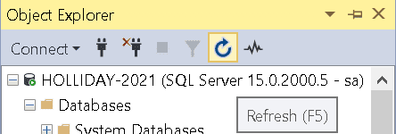
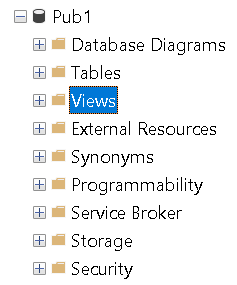

# SQL Part 2

## <p id = "toc"> Table of Contents </p>
0. [Lesson 0: Before We Begin](#0)
1. [Lesson 1: Using Nested Queries](#1)
2. [Lesson 2: Manipulating Table Data](#2)
3. [Lesson 3: Manipulating Table Structure](#3)
4. [Lesson 4: Working with Views](#4)
4. [Bonus Lesson: Procedures](#procedure)
5. [Lesson 5: Indexing Data](#5)
6. [Lesson 6: Managing Transactions](#6)
7. [Lesson 7: The End](#7)

/* -------------------------------------------------------
## <p id = "0"> LESSON 0: Before We Begin </p>
---------------------------------------------------------- */

Remember the helpful Mnemonic:  
Start Fridays With Grandma's Homemade Oatmeal

/* -------------------------------------------------------
## <p id = "1"> LESSON 1: Using Nested Queries | [Back to ToC](#toc) </p>
---------------------------------------------------------- */


SELECT * FROM Slspers  
WHERE commrate >   
	(SELECT AVG(commrate) FROM Slspers)


-- Exercise: Show all titles that are cheaper to develop than the cheapest obsolete title.  
SELECT *  
FROM Titles  
WHERE devcost < (SELECT MIN(devcost) FROM Obsolete_Titles);  


-- Same as if we use ALL Statement  
SELECT *  
FROM Titles  
WHERE devcost < ALL (Select devcost from Obsolete_Titles)  


-- ## Exercise: Show me all salespersons who have never made a sale.    
SELECT *  
FROM Slspers    
WHERE repid NOT IN    
(  
    SELECT repid  
    FROM Sales  
    GROUP BY repid  
)   


-- Returns all rows from Titles where a matching partnum exists in Sales.  
SELECT * FROM Titles  -- This statement alone will return 92 rows.  
WHERE partnum IN  
	(SELECT partnum    
	FROM Sales) -- Executes what's in parenthesis first  


-- Alternate Solution: Inner Join Statement  
SELECT DISTINCT t.*  
FROM Titles t  
INNER JOIN Sales s  
    ON t.partnum = s.partnum;  


-- For each row in Titles, output each row in Obsolete_Titles with the same partnum  
SELECT *  
FROM Titles  
WHERE EXISTS  
	(SELECT partnum  
	FROM Obsolete_Titles  
	WHERE partnum = Titles.partnum)  


-- Alternate Solution: INNER JOIN Statement  
SELECT t.*  
FROM Titles t  
INNER JOIN Obsolete_Titles o  
    ON t.partnum = o.partnum;  


-- ### Additional Example:  
SELECT *  
FROM Customers  
WHERE Custnum IN    
(  
    SELECT custnum    
    FROM Sales  
    WHERE partnum IN    
    (  
        SELECT partnum  
        FROM Titles  
        WHERE slprice >= 49    
    )  
);  


/* -------------------------------------------------------  
## <p id = "2"> LESSON 2: Manipulating Table Data | [Back to ToC](#toc) </p>  
---------------------------------------------------------- */  


Create a backup table of `Titles` called `TitlesRevised`  
``` sql
SELECT *  
INTO Titles_Revised  
FROM Titles
```

#### Recall that the Object Explorer must be refreshed to see the new table.  


> Additionally, refresh IntelliSense to avoid the red error underline on the newly created table name by going to:  
> Edit (Tab) -> IntelliSense -> Refresh Local Cache (Ctrl + Shift + R)  


Useful Trick: Create a new table `Slspers_Backup` with the same structure as `Slspers`, without copying any data (i.e. do not copy any rows.)
``` sql
-- Create a backup copy of `Slspers`  
SELECT *  
INTO Slspers_Backup    
FROM Slspers  
WHERE 1 = 0  -- always false
-- SQL Server does not support Boolean literals `TRUE` and `FALSE` in SQL queries. 
-- So instead, we must use an expression that evaluates to false.
```


Exercise #1 (Optional): Create an empty table called `Cust2025` based on the structure of the `Customers` table.
``` sql
SELECT *  
INTO Cust2025  
FROM Customers  
WHERE 1 = 0  -- always false
```


#### Different ways to delete a table:  
- DROP TABLE `Cust2025`  
- DROP TABLE IF EXISTS `Customers2025`;
- In the Object Explorer of SSMS, find the table you want to delete in your database (e.g. `Customers2025`).
  - Right-click the table and select 'Delete'.
  - A pop up 'Delete Object' dialog box will appear. Click 'OK' to drop the table.


---
<br/>

### <u> Aww, CRUD! </u>

#### CRUD refers to the four basic operations you can perform on data in a database: <br> Create, Read, Update, & Delete.

-- C -- Create  
-- R -- Read  
-- U -- Update  
-- D -- Delete	

--- 

## CRUD Overview

| Operation | SQL Example |
|-----------|-------------|
**C — Create** | `INSERT INTO table_name (column1, column2, ...) VALUES (value1, value2, ...);`
**R — Read**   | `SELECT * FROM table_name;`
**U — Update** | `UPDATE table_name SET column1 = value1 WHERE condition;` 
**D — Delete** | `DELETE FROM table_name WHERE condition;`

<br>

/* ------------ List of CRUD statements ------------ */  

> We will be modifying the backup tables.  
> NOTE: Be sure to make changes to the backup table, not the original!  

/* ------------ C: INSERT INTO statement ------------ */  

> NOTE: In SQL, the keyword `INTO` usually indicates that data is being written into something


(Jumping ahead) Optional Mention: The TRUNCATE statement removes all rows from a table  
``` TRUNCATE TABLE Slspers_Backup ```


#### Insert ONE Record (with all specified columns).  
``` sql
INSERT INTO Slspers_Backup    
--optional -- (repid, fname, lname, commrate)    
VALUES  
('J01', 'Jane', 'Doe' , 0.05)  
```

#### Insert a record with unspecified columns as NULL.  
``` sql
INSERT INTO Slspers_Backup (repid, fname)    
VALUES  
('N01', 'Nickki')  
```

#### Insert MANY (2+) records at once.     
``` sql
INSERT INTO Slspers_Backup    
VALUES  
('P01', 'Angie', 'Lopez' , 0.05),  
('P01', 'Steven', 'Stone' , 0.05)  -- Duplicate REPID 'P01' is intentional as it is a setup for a deletion example.  
```


#### (Jumping ahead) Optional: The TRUNCATE statement
``` sql 
TRUNCATE TABLE Slspers_Backup 
```


#### Copy all rows from `Slspers` and insert them into the `Slspers_Backup` table.
``` sql
INSERT INTO Slspers_Backup  
SELECT *  
FROM Slspers 
-- WHERE fname LIKE 'A%';  -- Additional Exercise: Inserting only records where the first names starts with "A" 
```


#### Exercise: Insert data from one table `Potential_Customers` into another table `Customers`.  
``` sql
INSERT INTO Customers  
SELECT *  
FROM Potential_Customers  
WHERE State = 'CA';  
```


-- End of Subsection Exercise: Add the following information into SQL Table 'Titles'  

```  
partnum bktitle                            devcost          slprice          pubdate  
------- ---------------------------------- ---------------- ---------------- -----------------------  
12345   The Role of SQL in Big Data        8000.00          45.00            2017-01-01 00:00:00  
```  

Solution:  
``` sql
INSERT INTO Titles_Revised  
-- optional -- (partnum, bktitle, devcost, slprice, pubdate)  
VALUES  
(12345, 'The Role of SQL in Big Data', 8000, 45, '2017-01-01')  
```


/* ------------ R: SELECT statement ------------ */  

#### Output the table  
``` sql
SELECT *  
FROM Slspers_Backup  
WHERE commrate = 0.05  
```

#### Output another table.  
``` sql
SELECT *  
FROM Titles_Revised  
WHERE partnum BETWEEN 40123 AND 40125 -- BETWEEN 39906 AND 39909 -- Check table with WHERE condition  
```

#### Exercise: Selects all rows from `Slspers` with `commrate` between 0.03 and 0.04, ordered by `commrate`.
``` sql
SELECT *  
FROM Slspers_Backup   
WHERE commrate BETWEEN 0.03 and 0.04  
ORDER BY commrate
```


/* ------------ U: Update Table ------------ */  

> Note: Before updating any rows with an UPDATE statement, it’s always a good idea to run a SELECT statement first to see exactly which rows will be updated. After knowing which rows the SELECT query returns, the conditions in the WHERE clause can then be reused in an UPDATE statement.

Update all salesperson commission from 0.3 to 0.6  
``` sql
UPDATE Slspers_Backup  
SET commrate = 0.06  
WHERE commrate = 0.03  -- NOTE: Always include a WHERE clause, or the UPDATE statement will affect all records!
```

-- Check:  
``` SELECT * FROM Slspers_Backup WHERE commrate = 0.06  ```


Exercise: Fix the spelling mistake of 'Anne' on RepID 'W02' to 'Annie'    
``` sql
-- Solution:  
UPDATE Slspers_Backup  
SET fname = 'Annie'  
WHERE REPID = 'W02'  
-- Bad Practice -- WHERE fname = 'Anne' -- Since there could be multiple 'Anne', this is bad practice.  
```


From the newly created `Titles_Revised` table, UPDATE `devcost` where `partnum` b/w 40123 & 40125  
``` sql
-- Solution
UPDATE Titles_Revised  
SET devcost = 21000  
WHERE partnum BETWEEN 40123 AND 40125 
-- WHERE partnum BETWEEN 39904 AND 39906  
```

-- Check Updated Table 
``` sql 
SELECT *  
FROM Titles_Revised  
WHERE partnum BETWEEN 40123 AND 40125  
-- WHERE partnum BETWEEN 39904 AND 39906  
```

-- Update Multiple Columns in a Table
``` sql
UPDATE 	Titles_Revised  
SET 	bktitle = 'Alex loves Windsurfing',  
		devcost = 5000,  
		slprice = 22,  
		pubdate = '2017/11/01'  
WHERE partnum='40123'  
```


-- Check Updated Table  
``` sql
SELECT *  
FROM Titles_Revised  
WHERE partnum = 40123  
```

/* ------------ D: Delete Rows ------------ */  

> Similar to the UPDATE statement, always verify which rows the DELETE query will remove by first running the SELECT query with the same WHERE clause.


Deletes all rows from Titles_Revised where partnum equals 40123.
``` sql
DELETE Titles_Revised  
WHERE partnum = 40123  
```

Check Updated Table  
``` sql
SELECT *  
FROM Titles_Revised  
-- WHERE partnum = 40123  
```

To Truncate All Rows  
``` sql
TRUNCATE TABLE Titles_Revised  
```

To Delete ALL Rows  
``` sql
DELETE FROM Titles_Revised  
```


-- To delete  
DELETE FROM Customers  
WHERE custnum = 31004;  

-- Another delete example  
DELETE FROM Slspers_Backup  
WHERE repid = '1';  


-- Exercise: Attempt to delete one of the Salespeople Paul that was added earlier.  
('P01', 'Paul', 'Smith' , 0.05)  

-- Solution:  
DELETE Slspers_Backup  
WHERE REPID = 'P01' AND fname = 'Paul'  


#### ===== End of Chapter Exercise =====  

Task #1 Exercise: Insert a new book into the Titles_Revised table with the following details  

```  
partnum 	bktitle						devcost 	slprice 	pubdate  
---------- 	-------------------------- 	---------- 	---------- 	----------  
98765 		Learn to Play the Violin 	5000.00 	45.00 		2025-01-01  
```

``` sql
-- Task #1 Solution: Insert a Record  
INSERT INTO Titles_Revised   
-- Optional -- (partnum, bktitle ,devcost, slprice, pubdate)   
VALUES (98765, 'Learn to Play the Violin', 5000, 45, '2010-05-11')  


-- Verify Insertion  
SELECT *  
FROM Titles_Revised    
WHERE partnum = 98765  
```

Task #2 Exercise: Update the book title with part number 98765 to: 'Learn to Play the Viola'  
``` sql
-- Task #2 Solution: Update the Record  
UPDATE Titles_Revised   
SET bktitle = 'Learn to Play the Viola'    
WHERE partnum = '98765'  


-- Verify Update  
SELECT *   
FROM Titles_Revised    
WHERE partnum = '98765'    
```

Task #3 Exercise: Delete the record with part number 98765.  
``` sql
-- Task #3 Solution:  
DELETE Titles_Revised   
WHERE partnum= '98765'   


-- Verify Deletion  
SELECT *  
FROM Titles_Revised   
WHERE partnum = '98765'  
```


/* -------------------------------------------------------  
## <p id = "3"> LESSON 3: Manipulating Table Structure | [Back to ToC](#toc)</p>  
---------------------------------------------------------- */  

A SQL data type defines the type of value a column can store.  
SQL data types are a core rule of the SQL table structure that restricts & validates the type of data that can go into a column, and is similar to the Data Validation tool in Excel.

Learn more about field Data types by going to the [Learn Microsoft Page.](https://learn.microsoft.com/en-us/sql/t-sql/data-types/data-types-transact-sql?view=sql-server-ver17)  


Step 1: Create the table  
``` sql
CREATE TABLE ProduceInventory (  
    ProduceName VARCHAR(50),  
    PricePerPound DECIMAL(5,2), -- Exactly 2 decimal places that goes up to 999.99  
    InStock BIT NOT NULL  -- Closest thing to a Boolean type in T-SQL.  A value of `0` represents false, and `1` represents true.  
);  
```

Step 2: Insert a few rows of data  
``` sql
INSERT INTO ProduceInventory (ProduceName, PricePerPound, InStock)  
VALUES  
('Cantaloupe', 0.50, 1),  
('Cucumbers', 0.25, 1),  
('Ginger', 0.99, 0);  
```

Step 3: Verify Data  
``` SELECT * FROM ProduceInventory ```

```
/* Following Output */  
Produce		Price ($/lb)	In Stock?  
Cantaloupe	$0.50 			TRUE  
Cucumbers	$0.25 			TRUE  
Ginger		$0.99 			FALSE  
/* End of Output */  
```


/* ------------ Check Info ------------ */  
sp_help ProduceInventory  


/* ------------ Truncate Table ------------ */  
TRUNCATE TABLE ProduceInventory  


/* ------------ DROP (Delete) Table ------------ */  
DROP TABLE ProduceInventory  


### Let’s now review CRUD operations related to affecting columns in a table.

In a previous section, we covered how to add and delete records (rows) in a table. In this subsection, we will cover how to add and remove columns and we will first create our duplicate table.

#### Recall: To create a Duplicate Table 
``` sql
SELECT *  
INTO Slspers_Backup  
FROM Slspers  
-- Please keep this table as it will be used in upcoming examples throughout this chapter.
```

Remember:  
-- The Object Explorer must be refreshed to see the new table.  
-- Additionally, refresh IntelliSense to avoid the red error underline on the table name by going to:  
-- Edit -> IntelliSense -> Refresh Local Cache (Ctrl + Shift + R)  


/* ------------ C: ADD Column to ALTER TABLE ------------ */  

``` sql
ALTER TABLE Slspers_Backup  
ADD email varchar(40)  
-- NOTE: Every column will contain NULL  
```

``` sql
-- Check Info on ALTERED Table  
sp_help Slspers_Backup  
```

``` sql
-- Fill every salesperson with generic email  
UPDATE Slspers_Backup  
SET email = 'test@outlook.com'  
WHERE email IS NULL;  
```

``` sql
-- Check Columns  
SELECT * FROM Slspers_Backup  
```

``` sql
-- Change Anna's email  
UPDATE Slspers_Backup  
SET email = 'annarules@outlook.com'  
WHERE fname = 'anna';  
```

``` sql
-- Check Columns
SELECT * FROM Slspers_Backup  
```


/* ------------ D: DROP Column to ALTER TABLE ------------ */  
``` sql
-- DROP Column IF EXISTS  
ALTER TABLE Slspers_Backup  
DROP COLUMN IF EXISTS email  
```

``` sql
-- Check Info on ALTERED Table  
sp_help Slspers_Backup  
```


/* ------------ U: Update/ALTER Column property ------------ */  

``` sql  
sp_help Slspers_Backup -- verify table  
-- if a column is nullable, it means that the column is allowed to contain NULL values i.e. values are optional
```

``` sql
-- First, verify that we can enter a NULL (blank) value for Fname  
INSERT INTO Slspers_Backup  
VALUES ('N01', NULL, 'Nguyen', 0.05)  
```

``` sql
-- Ensure that we delete said row
DELETE Slspers_Backup  
WHERE fname is NULL
```

#### Task: Change the fname column so it can hold up to 10 characters and is required (it cannot be left blank or NULL)  

> KEY NOTE: An  error may occur if some rows in the table already contain NULL (e.g. in fname column).  
SQL Server cannot enforce a column to be NOT NULL if there are NULL values that already exist in the table. 

Assure that `fname` holds no `NULL` values.  
``` sql
SELECT * FROM Slspers_Backup  
WHERE fname is NULL  
```

``` sql
-- Alter Table to have max 10 characters & not contain NULL values (a value is required).   
ALTER TABLE Slspers_Backup   
ALTER COLUMN fname varchar(10) NOT NULL  
```

Check TO VERIFY the change.  
``` sp_help Slspers_Backup ```  
-- NOTE: Under the column "Nullable", see that the fname column says 'No'   


Assure that the following query does NOT work:  
``` sql
INSERT INTO Slspers_Backup  
VALUES ('N01', NULL, 'Nguyen', 0.05)  
```

Executing the above query should now throw an error:  
```  
Cannot insert the value NULL into column 'fname', table 'Pub1.dbo.Slspers_Backup'; column does not allow nulls. INSERT fails.  
The statement has been terminated.  
```

Finally, to revert the column back to the way it was:
``` sql
ALTER TABLE Slspers_Backup   
ALTER COLUMN fname VARCHAR(40) NULL;  
```


/* ------------ CONSTRAINTS  i.e. Create a constraint after a table is already created. ------------ */

Constraints are rules that limit data. If the constraint is active, then inserting invalid data will fail.  
In SQL Server, constraints are separate objects, so we drop/remove the constraint to allow the user to enter invalid data again.  


#### Task: Add a rule (constraint) to make sure commission values are between 0 and 10% (0 to 0.1).  

First check to see if invalid data can be inputted.
``` sql
-- Invalid data can be initially be inserted since there are no constraints  
INSERT INTO Slspers_Backup  
VALUES (1, 'Finnie', 'Nguyen', 0.25);  
```

NOTE: Just like in the last example, please note that there can be NO existing commrate values that break the rule defined in chk_commrate. 
Please make sure you delete the constraint.

``` sql
DELETE FROM Slspers_Backup  
WHERE commrate = 0.25
```

To enforce a value range like 0 <= commrate <= 0.1, we'll use a CHECK constraint.  
``` sql
-- Adding the constraint to enforce Commission between 0 and 10%  
ALTER TABLE Slspers_Backup  
ADD CONSTRAINT chk_commrate CHECK (commrate >= 0 AND commrate <= 0.1);  
```

Constraints are stored in the database metadata, so you can always look them up later.
``` sql
-- To verify constraint  
EXEC sp_help 'Slspers_Backup';  
```

Output:
Constraint Type        | Constraint Name | Table | Column   | Status  | Option             | Constraint_Keys (Condition)            |
-----------------------|-----------------|-------|----------|---------|--------------------|----------------------------------------|
CHECK (commrate)       | chk_commrate    | N/A   | N/A      | Enabled | Is_For_Replication | ([commrate] >= 0 AND [commrate] <= 0.1)|


> Note: Additionally, in SSMS Object Explorer, expand the `Tables` folder and then expand `Constraints` folder to view your constraints.

So now, running the previous insertion will now fail   
``` sql
INSERT INTO Slspers_Backup  
VALUES (1, 'Finnie', 'Nguyen', 0.25); -- Invalid Insertion Data since 0.25 is greater than 0.1 (10%)  
```

Use `DROP CONSTRAINT` to remove the Constraint to allow any commission value  
``` sql
-- Remove the commission constraint  
ALTER TABLE Slspers_Backup  
DROP CONSTRAINT chk_commrate;  
```

Re-inserting data will now work after removing the constraint  
``` sql
INSERT INTO Slspers_Backup  
VALUES (1, 'Finnie', 'Nguyen', 0.25);  
```


/* ------------ ADDING A DEFAULT CONSTRAINT ------------ */

The DEFAULT keyword sets a value for future inserts only. 
It however does NOT change existing rows with 'some value' (this applies for rows that contain NULL values too.)   


``` sql
ALTER TABLE Slspers_Backup  
ADD CONSTRAINT df_commrate DEFAULT 0.02 FOR commrate;  
```

-- To verify constraint  
``` EXEC sp_help 'Slspers_Backup';  ```

``` sql
-- This works:   
INSERT INTO Slspers_Backup   
VALUES (1, 'Alice', 'Smith', 0.05);  
```

``` sql
-- This also works since we added a DEFAULT constraint of 0.02:  
INSERT INTO Slspers_Backup (repid, fname, lname)  
VALUES (1, 'Alice', 'Smith');  
```

``` sql
-- This does NOT work:  
INSERT INTO Slspers_Backup   
-- (repid, fname, lname) -- commenting this line out will not work since SQL Server expects values for all columns in the table  
VALUES (1, 'Alice', 'Smith');  
```

-- Verify:  
SELECT * FROM Slspers_Backup  


#### Notice about DROPPING CONSTRAINT!  
If a column has a constraint, dropping the column won't work since the constraint is dependent on column 'commrate':
```sql
-- will NOT work  
ALTER TABLE Slspers_Backup  
DROP COLUMN commrate 
```

First we must drop the constraint, and then we can drop the column.
``` sql
-- Step 1: First drop the default constraint  
ALTER TABLE Slspers_Backup  
DROP CONSTRAINT df_commrate; -- remember to use 'sp_help YourTableName' if you forget the constraints name.  


-- Step 2: Then drop the column  
ALTER TABLE Slspers_Backup  
DROP COLUMN commrate  


-- Step 3: Verify  
sp_help YourTableName   
```


/* ------------ Exercise: Try to add a default constraint  ------------ */  

-- Make a new constraint to add generic emails  
CONSTRAINT generic_email DEFAULT 'iloveSQL@gmail.com';  

-- Recall: Using SSMS, there are different ways of verifing constraints.   
One additional way is via the Design View. Right-click the table -> Design View   
Once the view is open, make sure to click on "Email"  
In the column properties pane, see the default under "Default Value or Binding".  


#### Solution
``` sql
ALTER TABLE Slspers_Backup
ADD email VARCHAR(20) 
    CONSTRAINT DF_Email DEFAULT 'iloveSQL@gmail.com'
```

``` sql
-- Test Constraint  
INSERT INTO  
Slspers_Backup (repid, fname, lname, commrate)  
Values  
('E04', 'Raza', 'Tahir', 0.01)  
```

``` sql
-- Drop Constraint
ALTER TABLE Slspers_Backup  
DROP CONSTRAINT DF_Email;
```
 
/* ------------ Primary KEY Constraint!!! ------------ */  
 
A Primary Key is a unique identifier for each record in a table and cannot contain duplicates or NULL values! You can have only 1 primary key per table unless it's a composite i.e. a combination of columns.  
-- NOTE: Make sure we affect the DUPLICATE table.


Warning: We can not make a column a primary key if it already contains duplicates.  
``` TRUNCATE TABLE Slspers_Backup  ```


-- SQL Server refuses to make it a primary key because NULLs are allowed  
``` sql
ALTER TABLE Slspers_Backup  
ALTER COLUMN repid varchar(6) NOT NULL; -- Exercise: Make the Slspers_Backup to be a NON null value.  
```

Check:
``` SP_HELP Slspers_Backup ```


``` sql
-- Add the Constraint
ALTER TABLE Slspers_Backup  
ADD CONSTRAINT pk_slspers PRIMARY KEY (repid);  
```

-- To verify constraint  
``` EXEC sp_help 'Slspers_Backup' ```


``` sql
INSERT INTO Slspers_Backup  
VALUES (1, 'Raza', 'Tahir', 0.05)   
```


``` sql
-- To Remove Constraint  
ALTER TABLE Slspers_Backup  
DROP CONSTRAINT pk_slspers;  
```

How to AutoIncrement Primary Key Constraint  
``` sql
-- Note: IDENTITY can only be set when the column is created  
ALTER TABLE Slspers_Backup  
ADD repid_new INT IDENTITY(1,1) PRIMARY KEY;  -- Starts at 1, increments by 1
-- We've added a new column 'REPID_NEW' 
```

``` sql
INSERT INTO Slspers_Backup (fname, lname, commrate) -- notice no mention of the newly added column 'repid_new' 
VALUES ('Raza', 'Tahir', 0.05)   
``` 

Check
``` sql
SELECT * FROM Slspers_Backup
```


/* -------------------------------------------------------  
## <p id = "4"> LESSON 4: Working with Views | [Back to ToC](#toc)</p>   
---------------------------------------------------------- */  


### Views  
A view gives the user a different way to look at data in a table (hence the name).  
For example, if you have a table and you want to hide certain fields, a view would be a great way to do that.

More formally, a SQL View is a virtual table and is essentially a saved query that references a table.  So think of it like a query that pretends to be a table.  
 
> Views are similar to dashboards in Excel/PowerBI & Views in SharePoint Lists  
> Fun Analogy: Think of a view like a work phone or laptop since it acts like a device with limited features.

> Note: A view does not store data on its own since it just stores the query.  
> If the original data changes, then the view will automatically reflect it. 

Views can be based on:  
- One entire table  
- A few columns from a table  
- Multiple joined tables  
- Subqueries  
- Functions  

#### Why Views Matter  
- Security  
	- A view can expose only specific rows and columns.  
	- So instead of giving users direct access to a table, we can create a view and allow users to only see the data through that.
	- DBAs can refuse/restrict access to tables but only grant access to views.  

- Ease of access  
	- Views reduce complexity. Instead of loading all 100 columns of a table, you only retrieve the 3 columns you need.  
	- Ultimately, it helps when manipulating/joining large tables.  

<br/>

NOTE: The difference between VIEWS & PROCEDURES  
- Views can't store/accept parameters (no input).  
- Doesn't contain procedural logic (no IF, loops, etc.).  
- A view definition can't use or contain DML statements such as INSERT, UPDATE, DROP and DELETE. 
	- A View definition can only use a SELECT query since it doesn't data.

> Note: While you cannot contain DML inside the view definition, you can use DML statements against a view. We will touch base with it here. 

---

#### Task #1: Create a view to show only people from state 'CA'  
``` sql
CREATE VIEW CA_Cust AS  
SELECT custname, city, state  
FROM Customers  
WHERE state = 'CA'
WITH CHECK OPTION -- This rule forces the view to reject any rows that don’t meet the view’s filter
-- Note: The ORDER BY clause is invalid in views.
```

Result:  After a View is created, expand/refresh the `Views` folder in the Object Explorer to now see the view.  

> NOTE: When creating the view, make sure to refresh Intellisense  
> Edit -> Intellisense -> Refresh Local Cache  

<br />

Now that a view is created, that view can be queried like a table.  
``` sql
SELECT * FROM Customers	-- Original Query still works
SELECT * FROM CA_Cust  	-- The view will only return customers from California.
```


We can insert data through the view, and it will update the original Customers table.
``` sql
-- Will work
INSERT INTO CA_Cust
VALUES 
('Nickkis Design', 'Oakland', 'CA')
```

Due to the `WITH CHECK OPTION`, any INSERT, UPDATE, or MERGE through the view must satisfy the view’s defining WHERE clause condition(s).

``` sql
-- Will NOT work
INSERT INTO CA_Cust
VALUES 
('Nickkis Design', 'Brooklyn', 'NY')
```


If needed, we can delete any customers from the view as well:  
``` sql
DELETE FROM CA_Cust
WHERE custname LIKE 'Nickki%'
```

> NOTE: A view will always show real-time data. 

Since a view doesn’t store data itself and is just a saved query on a table:  
- If we delete data through the view, we'll actually be deleting it from the underlying table, because that’s where the real data is stored.  
- If we delete data on the original table, the view will update.


Syntax to Delete (Drop) a View  
``` DROP VIEW CA_Cust  ```

--- 

#### Bonus Example: Create a View via the Object Explorer Interface.
As we've seen, views can be created using raw SQL code, but here's how to access & create views via the Object Explorer in SSMS.

Step 1: Navigate to the database where the view will be created. Expand the database, and notice the "Views" folder.



Step 2: Right-click on the 'Views' folder and select "New View." On the alert, choose the table you want to base your view on. In this example, select the `Titles_Revised` table, click 'Add', and then close the dialog box.

Step 3: Let's suppose the goal is for users to view some data from the `Titles_Revised` table. To do that, simply select all the fields we'd like to include. As you click each field, the column gets added to the view.

Step 4: Once all the fields have been added, save the view. Click the save icon or just close the window and confirm the save. Give the view a name, like `TitlesInfo`.

Result: Now the view is created. To run it, expand the Views folder, find the new view, right-click it, and select "Select Top 1000 Rows" or run a SELECT query. You’ll see the data returned just like in a standard  table.

---

#### Task: #2  
Create a virtual table called 'Top_Salesperson' that shows repid, fname & commrate.  

``` sql
CREATE VIEW Top_Salesperson AS  
SELECT repid, fname, commrate  -- 3 Columns    
FROM Slspers_Backup  
WHERE commrate > 0.04  
WITH CHECK OPTION
```

-- Displays the SQL code used to define the view.  
``` sp_helptext Top_Salesperson ```

``` sql
Insertions will ONLY work when the number of values matches the number of columns.  
-- INSERT INTO Top_Salesperson VALUES (1, 'John', 'Smith', 0.5); -- Won't Work since this inserts 4 values, but the view only has 3 columns.  
-- INSERT INTO Top_Salesperson VALUES (1, 'John', 0.05);  -- Will Work  

Adding records where commrate is above 0.04 will ONLY work.  
-- INSERT INTO Top_Salesperson VALUES (1, 'Elvis', 0.03);  -- Won't Work    
-- INSERT INTO Top_Salesperson VALUES (1, 'Elvis', 0.06);  -- Will Work 

-- Verify: -- SELECT * FROM Top_Salesperson  
```

#### Subtask: Alter the Salesperson view to now only display fname & commrate  
``` sql
-- Change ALTER VIEW with CREATE VIEW to update the view instead of making a new one.  
CREATE OR ALTER VIEW Top_Salesperson AS 
SELECT fname, commrate    
FROM Slspers_Backup  
WHERE commrate > 0.04  
WITH CHECK OPTION
```

Verify:  
``` SELECT * FROM Top_Salesperson ```

NOTE: Once we drop the view...  
``` DROP VIEW Top_Salesperson  ```

...we won't be able to use the view:  
``` SELECT * FROM Top_Salesperson -- Won't work ```


> Bonus Option: We can grant users read only, but not insert/update/delete operations.
``` sql
GRANT SELECT ON CA_Cust TO some_user;
REVOKE INSERT, UPDATE, DELETE ON CA_Cust FROM some_user;
```

/* ------------ EXERCISE SNIPPET: Activity 4-1 Step 3B ------------ */  

``` sql
CREATE VIEW mediumprice AS  
SELECT partnum, bktitle, slprice  
FROM Titles_Revised    
WHERE slprice BETWEEN 20 AND 30  


-- Verify that the View works.  
SELECT * FROM mediumprice ORDER BY slprice  


-- NOTE: The View will not return any books outside of that range...
SELECT *  
FROM mediumprice
WHERE partnum = '40121' -- This book title has a slprice of $36.50 


-- ...but the table will still hold the data.
SELECT *  
FROM Titles_Revised
WHERE partnum = '40121'


-- Insert 2 titles via the View  
INSERT mediumprice (partnum, bktitle, slprice)  
VALUES ('40256', 'How to Play Violin (Intermediate)', 22)  

INSERT mediumprice (partnum, bktitle, slprice)  
VALUES ('40257', 'How to Play Violin (Advanced)', 23)  


-- Verify that the insertions have worked  
SELECT *  
FROM mediumprice  
WHERE partnum IN ('40256', '40257')  
-- WHERE partnum BETWEEN '40250' AND '40259' -- also works


-- Using the View, update the price in both the view & table  
UPDATE mediumprice  
SET slprice = 30  
WHERE partnum = '40257'  


-- Check Update (Both queries are the same)  
SELECT * FROM mediumprice WHERE partnum = '40257'  
SELECT * FROM Titles_Revised WHERE partnum = '40257'  -- Note that the record in the actual table contains NULLs


-- Use the View to delete a specific Title.  
DELETE mediumprice  
WHERE partnum = '40257'  


-- Chcek that it got deleted.  
SELECT *  
FROM mediumprice  
WHERE partnum = '40257'  


-- Finish the exercise by dropping the view.  
DROP VIEW mediumprice  
```


/* -------------------------------------------------------  
## <p id = "procedure"> Bonus Lesson: Procedures | [Back to ToC](#toc)</p>   
---------------------------------------------------------- */  


Before we understand what a Procedure is, let's first understand what is Conditional Logic.

> SQL can execute basic logic  

``` sql 
IF 1 = 1  
    PRINT 'This is true';  
```

> IF statements can only be used inside T-SQL blocks (e.g., stored procedures, scripts)  

``` sql
SELECT COUNT(*) From Slspers -- Output: 10  

IF ( ( SELECT COUNT(*) From Slspers ) > 5 )  
	PRINT 'More than 5'  
ELSE  
	PRINT 'Less than or equal to 5'  
```
 

BEGIN/END block defines a statement block which is a group of T-SQL statements executed as a single unit in procedural logic. Think of them as curly braces {} like in C, Java, or JavaScript. Without BEGIN/END Block, only the first statement gets printed.

``` sql
-- This code will NOT work  
IF (3 + 3) != 6  
	PRINT 'Condition is true';   
	PRINT 'Do more things here'; -- the second PRINT is not part of the IF, so it runs regardless of the condition. In other words, the statement becomes printed when it shouldn't i.e. it always runs
```

In programming we can think  of it like this:
```
IF condition
    statement1  <--  Only this line belongs to the IF
statement2  <-- always runs
```

``` sql
-- Nothing becomes printed as it should.  
IF ( 3 + 3) != 6  
BEGIN  
    PRINT 'Condition is true';  
    PRINT 'Do more things here';  
END   
```

In programming we can think of it like this:
```
IF condition {
    statement1
    statement2
}
```


### Another Example

``` sql
-- This code will NOT execute.  
IF ( ( SELECT COUNT(*) From Slspers ) > 5 )  
	PRINT 'More than 5'  
	PRINT 'Hooray!'  
ELSE  
	PRINT 'Less than or equal to 5'  
	PRINT 'Oh no!'  
```

```  sql
-- This code WILL execute.  
IF ( ( SELECT COUNT(*) From Slspers ) > 5 )  
	BEGIN  
		PRINT	'More than 5'  
		PRINT	'Hooray!'  
	END  
ELSE  
	BEGIN  
		PRINT 'Less than or equal to 5'  
		PRINT 'Oh no!'  
	END  
```  

___

Now that we understand what is Conditional Logic, let's understand Procedures.

In SQL, A stored procedure is a reusable block of code; it is a saved set of SQL commands to perform specific tasks that can be executed whenever needed.  

Procedures can be used like a function or a script inside the database. Each procedure is a standalone operation that executes a block of saved code and can be reused anytime.

> [From W3Schools](https://www.w3schools.com/sql/sql_stored_procedures.asp):  
"If you have an SQL query that you write over and over again, save it as a stored procedure, and then just call it to execute it."


> Since Procedures add PROGRAMMABILITY, they are similar to FUNCTIONS.  

SQL Server provides a built-in stored procedure to list all procedures in the current database.  
``` EXEC sp_stored_procedures; ```

For instance, another built-in stored procedure we've seen before in the SQL Part 1 Class is `sp_help`:  
``` EXEC SP_Help Slspers ```

> 1st NOTE:  

A View:  
- Can't accept parameters (no input).  
- Doesn't run conditional logic (e.g. no IFs)  
- Can't use loops  
- Can't use DML opeartions (a view definition cannot contain DML statements such as INSERT, UPDATE, DROP AND DELETE)

A view is a saved query with inline SQL so it doesn’t execute logic.  
A stored procedure can run logic, like IF, SET, or UPDATE statements.  

We shouldn't use a view solely for inserting data, but rather, a procedure is more effective when making insertions. 
For example, adding/deleting users/orders to a database is often a routine task, so it makes sense to create a procedure to handle it.


> 2nd NOTE: 

Keep in mind that a Procedure is not a dataset; it cannot attach a WHERE clause directly to a stored procedure call.  
When your procedure runs a SELECT, it outputs a <b> result set </b>.

---

#### Demo #1
A common example of a procedure is retrieving data using a lookup value as an input to get specific results (similar to an Excel VLOOKUP)

Possible Applications: Find a student based off their student email or StudentID, etc.

``` sql
-- A procedure called `GetCustomerDetails` that takes a CustomerID as an input and returns that customer’s information.
CREATE OR ALTER PROCEDURE GetCustomerDetails
	@CustID NVARCHAR(10)
AS
BEGIN
    SET NOCOUNT ON; -- Suppresses "rows affected" messages

    SELECT Custnum, Custname, City, State  
    FROM Customers  
	WHERE Custnum = @CustID  
END;
```

Once a procedure is saved, run the procedure via the Execute statement:  
``` sql
EXEC GetCustomerDetails @CustID = '20042' 
```


Stored Procedures exist at the database level. One way to list all stored procedures in the database:
``` sql
SELECT name
FROM sys.procedures
ORDER BY name;
```

Another way to view Stored Procedures would be under:  
Pub1 -> Programmability -> Stored Precedures  

To drop the procedure:  
``` DROP PROCEDURE GetCustomerDetails ```

---

#### Demo #2
Create a procedure to get the Top 5 Saleperson  
(This example can be rewritten to get Top 5 Selling Products). 

``` sql
CREATE OR ALTER PROCEDURE GetTopSlspers
AS
BEGIN
    SET NOCOUNT ON;

    SELECT 
	TOP (5) WITH TIES  -- include duplicates
	fname, commrate
	FROM Slspers
	ORDER BY commrate DESC;
END;
```

> Note: The above example includes additional rows when there are duplicates (ties) and/or based on a specific date range.

Run the Procedure:
``` sql
EXEC GetTopSlspers 
-- NOTE: The EXEC keyword is optional; you can run the procedure simply by calling:
-- GetTopSlspers
```

---

#### Demo #3: Simplified
Create a procedure that generates a backup of the `Slspers` table.

``` sql
CREATE OR ALTER PROCEDURE GenerateSlsPersBackup
AS
BEGIN
	SET NOCOUNT ON;

	DROP TABLE IF EXISTS Slspers_Backup

	SELECT *
	INTO Slspers_Backup  
	FROM Slspers
END;
```

Now to run the backup:  
``` EXEC GenerateSlsPersBackup ```

Now suppose we somehow mess up the backup table:  
``` UPDATE Slspers_Backup SET fname = 'Raza' ```

You should be able to verify that all the names have been updated:  
``` SELECT * FROM Slspers_Backup ```

But now if you run the same backup command again to overwrite the previous backup:  
``` EXEC GenerateSlsPersBackup ```

Running the SELECT query should show all the original names:  
``` SELECT * FROM Slspers_Backup ```

Finally, to drop the procedure:  
``` DROP PROCEDURE GenerateSlsPersBackup ```


#### Demo #3: Longer Version
Create a backup database of 'Pub1'

- Step #1: Create a folder 'SQLP2BackupFolder' in my documents.
- Step #2: Open Folder Properties
	- Go to the folder you created, e.g., C:\Backup
	- Right-click the folder -> Properties -> Security tab  
- Step 3: Add “Everyone” (Temporary Easy Fix)
	- Click Edit…
	- Click Add…
	- In the box, type: 'Everyone'
	- Click Check Names → it should underline Everyone
	- Click OK  
- Step 4: Give Full Control
	- In the Permissions window for Everyone:
	- Check Full Control
	- Click Apply → OK

Result: This will gives all users (including SQL Server) permission to write to this folder.


``` sql
CREATE OR ALTER PROCEDURE GeneratePub1Backup
AS
BEGIN
	SET NOCOUNT ON;

	BACKUP DATABASE pub1
	TO DISK = 'C:\Users\Razat\Documents\SQLP2BackupFolder\testPub1.bak'; 
	/* NOTE: The path should specify a file name with a .bak extension. NOT to a folder. */
END;
```

---

#### Optional Demo #4:  
Create a Procedure that inserts a record into 2 seperate tables: `PotentialCustomers` table & `Customers` table.  
(An additional example can be used where a procedure can be made to update/delete from 2 tables.)

``` sql
CREATE OR ALTER PROCEDURE InsertSlsPers
    @FirstName VARCHAR(50),
    @LastName  VARCHAR(50)
AS
BEGIN
    SET NOCOUNT ON;

    INSERT INTO 
	Slspers_Backup (fname, lname)
    VALUES (@FirstName, @LastName);

	INSERT INTO 
	Slspers (fname, lname)
    VALUES (@FirstName, @LastName);
END;
```

EXEC InsertSlsPers @FirstName = 'Raza', @LastName = 'Tahir'

---

#### Optional Task: 
Write a stored procedure that accepts a @State parameter, and retrieves all matching records from the PotentialCustomers table,   
and inserts those records into the Customers table.  

``` sql
CREATE PROCEDURE InsertPotentialCustomersByState  
    @State NVARCHAR(50)  
AS  
BEGIN  
   	-- Optional -- SET NOCOUNT ON;  
	-- Always add SET NOCOUNT ON; at the top of your stored procedures unless you specifically need the row count messages.  

    INSERT INTO Customers  
    SELECT *  
    FROM Potential_Customers  
    WHERE State = @State;  
END;  
```

``` EXEC InsertPotentialCustomersByState @State = 'CA';  ```

-- CHECK  
``` 
SELECT * FROM Customers  
WHERE STATE = 'CA'  
```

``` EXEC InsertPotentialCustomersByState @State = 'NY';  ```

-- CHECK  
```
SELECT * FROM Customers  
WHERE STATE = 'NY'  
```

-- TO DELETE THE PROCEDURE:  
``` DROP PROCEDURE InsertPotentialCustomersByState;  ```

---

```
If a view is updateable, you can only insert into one underlying (base) table through it.  
If you need to insert into multiple tables, the view alone won’t handle that. You could use a trigger to do extra inserts automatically.  
But it’s usually better to use a stored procedure, because a procedure can easily insert two rows — one in each table — in a clear and controlled way.  
```


/* -------------------------------------------------------  
## <p id = "5"> Lesson 5: Indexing Data | [Back to ToC](#toc)</p>   
---------------------------------------------------------- */  

Speeds up sorts & searches especially common ones  


/* -------------------------------------------------------  
## <p id = "6"> LESSON 6: Managing Transactions | [Back to ToC](#toc)</p>   
---------------------------------------------------------- */  

Transactions protects your database from partial updates.  

When runing multiple queries, transactions ensure that a series of operations are executed as a single unit of work.   
> Think of it as 'ALL OR NOTHING'. Either the statements all succeed (committed) or all fail (rolled back).  

Once a transaction is committed or rolled back, the transaction ends and can't be undone or rolled back.  

Common Examples of Transactions could be:  

	- Bank Transfers from Saving -> Checking  
		Step 1: Subtract amount from Account A (Saving).  
		Step 2: Add amount to Account B (Checking).  

		BEGIN TRANSACTION;  
			UPDATE accounts SET savingBalance = savingBalance - 500 WHERE account_id = '123';  
			UPDATE accounts SET checkingBalance = checkingBalance + 500 WHERE account_id = '123';  
		COMMIT;  

	- Inventory Management  
		Step 1: Insert a new record into the Orders table.  
		Step 2: Deduct items from Inventory table.  
		Step 3: Update customer’s balance in Accounts table.  

	- HRIS Systems to manage employee records.
		Example: Have a procedure named DeleteEmployee that removes an employee record and includes TRY...CATCH blocks for robust error handling across different tables.


#### Example #1

Create a transaction that inserts two salesperson records.  
This is a good way to test for errors before the code becomes implemented.

``` sql
BEGIN TRANSACTION;  
INSERT INTO Slspers_Backup VALUES ('N123', 'Jennifer', 'Reyes', 0.05)  
INSERT INTO Slspers_Backup VALUES ('L123', 'Lena', 'Duong', 0.05)  
ROLLBACK TRANSACTION; -- Switch 'ROLLBACK' with 'COMMIT' TRANSACTION when ready to implement  
```

-- Check  
``` SELECT * FROM Slspers_Backup ```


#### Example #2

To start off this example, first create the following table: 

``` sql
-- First create a table with a UNIQUE field.
CREATE TABLE person (  
    name VARCHAR(100) UNIQUE  
);  

-- Then, insert the following names (without a transaction):  
INSERT INTO person (name) VALUES ('Alice');  
INSERT INTO person (name) VALUES ('Bob');  
INSERT INTO person (name) VALUES ('Alice'); -- duplicate  
```

The first two inserts will work, but the third will fail because name must be unique. i.e. the table becomes only partially filled.  

Execute the code ```  SELECT * FROM person ``` will show the contents of the Person table.  

```  
-- Output:  
Alice  
Bob  
```  

> To reset the table for the solution:  
TRUNCATE TABLE Person  

Task: Create a transaction to ensures that if the third insert fails, no rows are saved.  

``` sql
-- Solution:
BEGIN TRANSACTION;  

INSERT INTO person (name) VALUES ('Alice');  
INSERT INTO person (name) VALUES ('Bob');  
INSERT INTO person (name) VALUES ('Alice');  -- duplicate name (violates UNIQUE constraint)  

COMMIT TRANSACTION;  
```

The transaction will not execute any of the statements until everything (particularly the 3rd line) is correct. Either all or nothing becomes executed.  


#### Example #3  

A TRY/CATCH block can be used as a way of Exception Handling.  

How it works:  
If all operations in the TRY block succeed, then the COMMIT block is then executed.    
If any error occurs, control moves to the CATCH block and ROLLBACK TRAN is executed instead.  

First confirm that a table has been created.  
```
CREATE TABLE person (  
	name VARCHAR(100) UNIQUE  
);  
```

Create the Transaction:
```
BEGIN TRANSACTION;  
BEGIN TRY  
	-- Some SQL statements  
	INSERT INTO perso VALUES ('Alice'); -- Table 'Person' misspelled on purpose.  
END TRY  
BEGIN CATCH  
	ROLLBACK TRANSACTION;  
	SELECT * FROM Person  
	PRINT('Log Error')  
END CATCH  
```


/* -------------------------------------------------------  
## <p id = "7"> LESSON 7: The End | [Back to ToC](#toc)</p>   
---------------------------------------------------------- */ 

-- Bonus Chapter --  
/* ------------ Check Tables ------------ */  
SELECT *  
FROM Pub2.INFORMATION_SCHEMA.TABLES  


/* ------------ Drop Tables & Confirm ------------ */  
DROP TABLE Obsolete_Titles1  
DROP TABLE Potential_Customers1  

SELECT *  
FROM Pub2.INFORMATION_SCHEMA.TABLES  


-- Bonus Comments --  
In SQL Server, when you run a query like INSERT, UPDATE, or DELETE, SQL Server by default returns a message like:

``` (3 rows affected) ```

This message is informational, but in some scenarios (like stored procedures or loops), it can clutter the output.    
Solution:  
SET NOCOUNT ON -- WILL THEN SUPPRESS THE MESSAGE


-- Example   
SET NOCOUNT ON;   
UPDATE Customers SET State = 'CA' WHERE State = 'California';


— Additional —
* Create a PivotTable from a SQL Server table  
* Create custom shortcut keys for useful commands  
* Create a new database  
* Create a database backup  
* Restore a deleted table from a backup  
* Understand transaction logs  
* Hide a column but allow inserts (using trigger)  
* Display SQL P2.txt file  